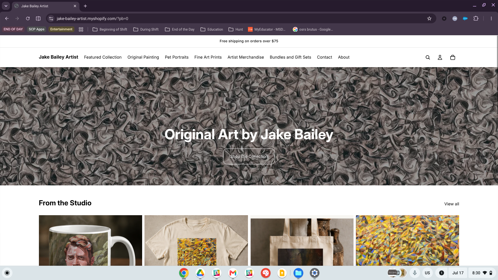
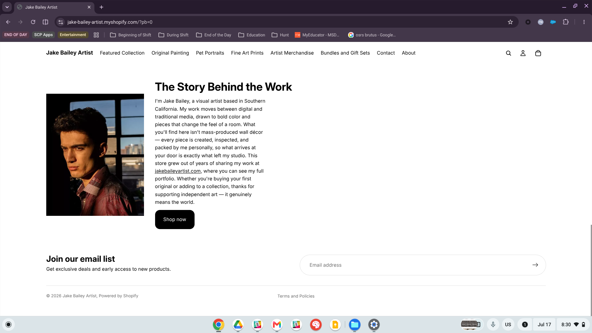
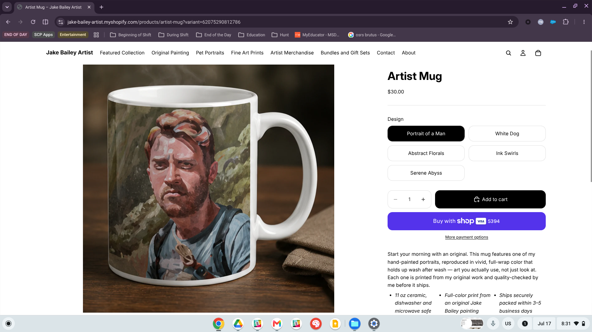
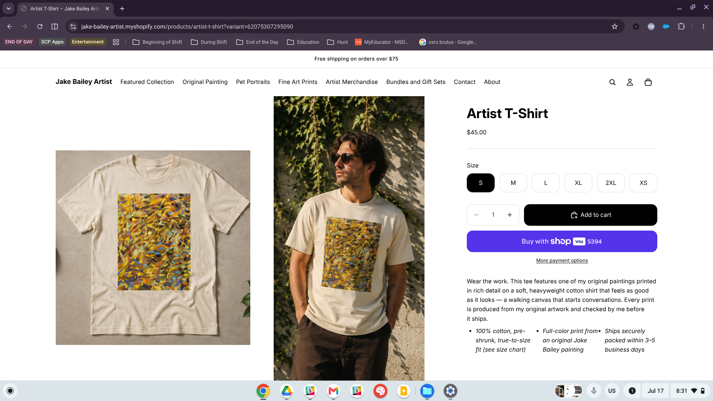
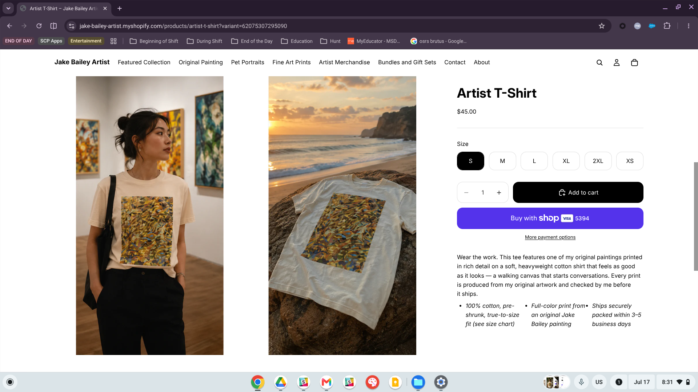
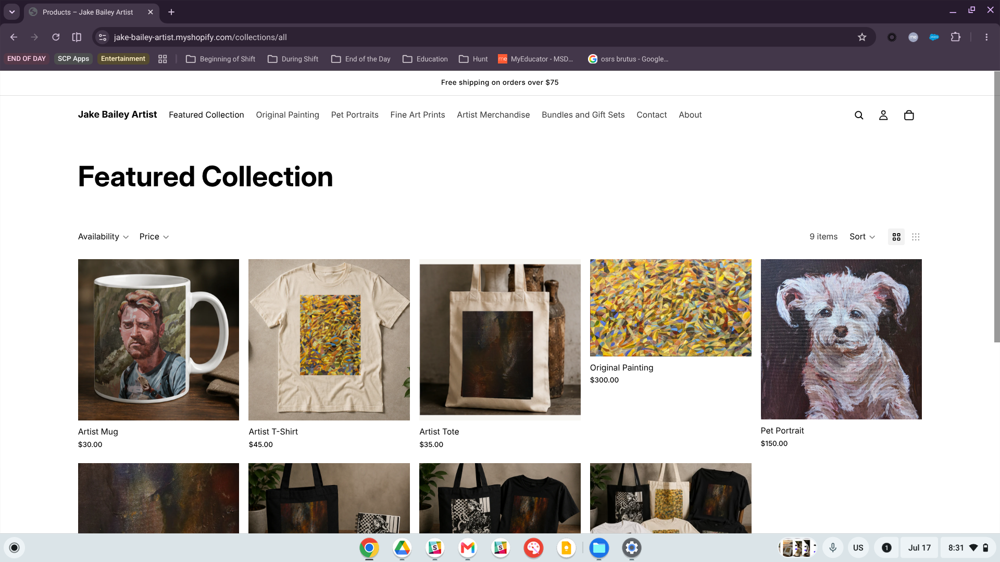

# Introduction

The purpose of this assignment is to improve the design and overall customer experience of my practice Shopify storefront, **Jake Bailey Artist** ([jake-bailey-artist.myshopify.com](https://jake-bailey-artist.myshopify.com)). A successful retail website needs to be visually appealing, easy to navigate, informative, and trustworthy. Since online customers cannot physically touch or try the products before purchasing, the website has to do much of the persuasive work for them. Using the Official Shopify Tutorial (Part 4) on conversion optimization as a guide, I redesigned the homepage, rebuilt both featured product pages, and improved the Featured Work collection page using the Horizon theme. The screenshots below document the updated storefront, while the following sections explain the changes made to each page, highlight the customer experience improvements, walk through the resulting customer journey, and connect these lessons to the CPP Farm Store consulting project.
# Homepage Improvement

The homepage now answers a first-time visitor’s most important question—what does this store sell?—within just a few seconds. The redesigned hero section uses a full-width background created from my own artwork, paired with the headline **“Original Art by Jake Bailey”** and a clear **“Shop the Collection”** call-to-action button that takes customers directly to the Featured Work collection page. I also added an **announcement bar** above the header that reads “Free shipping on orders over \$75,” so customers see shipping information before reaching checkout. This supports the idea of being transparent about costs early in the shopping process, which can help reduce cart abandonment.

{#fig-home-after}

Below the hero section, I added a **“From the Studio”** featured-products section that gives customers a preview of the catalog through product cards and a **“View all”** link to the complete collection. I intentionally used the title “From the Studio” instead of repeating the collection name so visitors can clearly tell the difference between the homepage preview and the Featured Work collection page it leads to. This follows the tutorial’s recommendation that website labels should be simple and easy to understand. Beneath that section, I added **“The Story Behind the Work,”** which introduces me as the artist through a personal photo and a link to my professional portfolio at [jakebaileyartist.com](https://jakebaileyartist.com). For a small independent store, this adds an important layer of trust by showing customers who created the artwork and the story behind it.

{#fig-home-after2}

I also checked the homepage using the theme editor’s mobile preview. The hero headline wraps cleanly and remains easy to read over the artwork background, the announcement bar stays visible, and the search icon remains prominent in the header. This is especially important for mobile shoppers, who may prefer searching for a product instead of navigating through several menu options.

# Product Page Improvements

Product pages are where customers make their final buying decisions, so I rebuilt the store’s two featured product pages using two different improvement strategies. One focused on creating a clearer merchandising structure, while the other focused on improving the product photography.

## Product Page 1: Artist Mug — Named Design Variants

The Artist Mug page was redesigned from a single-design listing into one product with a **Design** variant that includes five named artworks: Portrait of a Man, White Dog, Abstract Florals, Ink Swirls, and Serene Abyss. Each option is connected to its own product image, so the gallery updates as soon as a customer selects a design. The selected artwork name also carries through to the cart, checkout, and order confirmation. Using the actual artwork titles instead of generic labels like “Design 1” or “Design 2” strengthens the original-art branding and makes it easier for customers to compare the full assortment without moving between separate product pages. This applies the Chapter 12 assortment concept at the product level by offering meaningful depth within one category and organizing it in a way that supports comparison.

I also rewrote the description to lead with the main benefit—“art you actually use, not just look at”—before moving into the supporting product details. Practical information such as the ceramic material, care instructions, and shipping timeline is now included directly on the product page instead of being buried elsewhere on the site.

{#fig-p1-after}

## Product Page 2: Artist T-Shirt — Multi-Angle Photography

The Artist T-Shirt page uses the opposite strategy: one design presented the way a customer would naturally examine it in person. The gallery now includes a **flat-lay image** that clearly shows the printed artwork, a **worn photo** that demonstrates the real-world fit, an additional angle, and a **lifestyle image**. Together, these images answer two important questions online apparel shoppers often have: “What does the design look like up close?” and “How will the shirt actually fit?” Because uncertainty about fit is one of the biggest barriers to buying clothing online, the worn photo is especially valuable.

The size options are also arranged in the correct order from XS through 2XL. I rewrote the description to lead with the benefit—“wear the work—a walking canvas that starts conversations”—before explaining the cotton material and true-to-size fit. Shipping expectations are also included directly in the description near the purchase button, so customers have the information they need before adding the shirt to their cart.
{#fig-p2-after}

{#fig-p2-after2}

# Collection Page Improvement

The **Featured Collection** page was transformed from a basic product grid into a more complete and branded category page. It also follows the tutorial’s recommendation to use clear, descriptive category language instead of vague or overly clever branding.

The page displays all seven products, including mugs, T-shirts, and tote bags, in one consistent grid. It also serves as the main destination for the homepage hero button, the **“From the Studio”** View-all link, and the main navigation menu. Directing all three paths to the same collection keeps the shopping experience consistent and allows customers to reach every product within two or three clicks.
{#fig-c-after}

# Customer Experience Improvements

Beyond the page-level redesigns above, I made the following customer experience improvements.

## Improvement 1: Simplified Navigation and Unambiguous Labeling

I reorganized the navigation through **Content → Menus** in the Horizon theme so every product can be reached within two or three clicks from the homepage: homepage → Featured Work collection → product page. The main menu, hero button, and **“View all”** link in the homepage product section now all lead to the same polished collection page instead of splitting customers between that page and the generic auto-generated catalog. This creates one clear shopping path and makes the site easier to navigate.

I also renamed the homepage preview section **“From the Studio”** so it would not have the same name as the **Featured Work** collection page it links to. It is a small change, but it makes the relationship between the homepage preview and the full collection much clearer.

## Improvement 2: Benefit-Driven Descriptions with Trust Signals

Both product descriptions were rewritten to lead with the benefits and story before moving into the specifications, following the tutorial’s principle of **“lead with benefits, support with features.”** Because I sell original artwork under my own name, building trust is especially important throughout the store. The homepage story section introduces me with a personal photo, the collection description explains that every print is personally checked before shipping, and repeated links to my professional portfolio at [jakebaileyartist.com](https://jakebaileyartist.com) show customers who created the work and why they can feel confident purchasing it.

This also connects to the private-label branding concept from Chapter 13. In this case, my identity as the artist becomes part of the brand itself and gives the products a point of differentiation that customers cannot easily compare with another store.

## Improvement 3: Named Variant Merchandising

Combining the five mug designs into one product listing with named **Design** variants made the assortment much easier to compare. Customers can select options such as “Serene Abyss” or “Ink Swirls” by name, and the product image updates immediately to match their choice. The selected artwork title also carries through to the cart and checkout. This reduces unnecessary clicks, keeps customers on the product page while they are deciding, and presents the assortment depth in the organized way described in Chapter 12—within one category rather than scattered across several separate listings.

## Improvement 4: Early Cost Transparency and Clear Calls to Action

The announcement bar now displays the free-shipping threshold—“Free shipping on orders over \$75”—across every page of the store. This allows customers to consider shipping costs before they reach checkout instead of being surprised at the final step, which is one of the common sources of friction behind the high rate of cart abandonment discussed in the tutorial.

Each page also has one clear primary action. The homepage hero directs visitors to **“Shop the Collection,”** while each product page features a prominent **Add to Cart** button. Important information such as sizing and shipping expectations is placed near the purchase area, so customers can make a decision without searching elsewhere on the site.

# Customer Journey Reflection

A customer arriving at the improved storefront immediately understands what the store sells. The homepage opens with the headline **“Original Art by Jake Bailey”** placed over my own artwork, while the free-shipping announcement is visible before the customer even begins scrolling. From there, the hero’s **“Shop the Collection”** button, the **“From the Studio”** product preview, and the main navigation menu all lead to the same Featured Work collection page. This creates one clear path through the store and keeps every product within two or three clicks of the homepage.

Once customers reach the collection page, the description explains what the collection includes and introduces the artist behind the work. From there, one more click opens a product page that provides much of the information a customer would normally gather during an in-person gallery or retail visit. On the mug page, customers can compare five named artworks while the product image updates with each selection. On the T-shirt page, the flat-lay, close-up, and worn photos help answer common questions about print quality and fit. Benefit-focused descriptions help customers imagine owning the product, while sizing, care, and shipping details appear close to the **Add to Cart** button. By the time customers reach checkout, they understand what they are purchasing, who created it, what to expect from shipping, and why the product is worth buying.

# CPP Farm Store Application Reflection

The CPP Farm Store should build its online storefront around the same principles that guided these improvements: communicate its identity right away, organize products into clearly named collections, and reduce friction between discovery and purchase. The Farm Store’s biggest advantage is its story—student-run, Cal Poly Pomona-grown, and connected to local agriculture. That story deserves a prominent place on the homepage because it builds trust and gives the store something competing grocery retailers cannot easily copy.

Because the Farm Store carries a much wider assortment than my store, including produce, meats, pantry items, gifts, and plants, the category-management concepts from Chapter 12 are even more important. Collections should use clear, descriptive names, the most distinctive categories should receive featured placement, and every product should remain within three clicks of the homepage. The named-variant approach I used for the mug designs could also work well for Farm Store products that come in multiple sizes or flavors, allowing customers to compare their options on one page instead of moving between several nearly identical listings.

The Farm Store should also communicate fulfillment details as early as possible. Many of its products involve pickup instructions, seasonal availability, or perishability, so customers need to understand how and when they will receive their orders before reaching checkout. An announcement bar or other highly visible message could provide this information across the entire website, applying the same early-transparency principle used in my storefront to reduce confusion and cart abandonment.

# Conclusion

This assignment transformed a functional but generic storefront into a more intentional customer experience. The homepage now communicates the brand immediately and guides customers along one clear shopping path. The two product pages demonstrate different improvement strategies: named-variant merchandising for the Artist Mug and multi-angle product photography for the Artist T-Shirt. The Featured Work collection page organizes the assortment with clear, trust-building language, while improved navigation, labeling, and shipping transparency reduce friction throughout the customer journey. The same overall approach—lead with identity, create clear categories, minimize clicks, and communicate important details early—can be applied directly to the CPP Farm Store consulting project.

# Appendix

## Published Report

- **GitHub Pages:** [https://jakevns.github.io/RStudio/A5/Evans%2CJake-IBM6300-A5.html](https://jakevns.github.io/RStudio/A5/Evans%2CJake-IBM6300-A5.html)

## Repository

- **GitHub Repo:** [https://github.com/jakevns/RStudio/tree/main/A5](https://github.com/jakevns/RStudio/tree/main/A5)