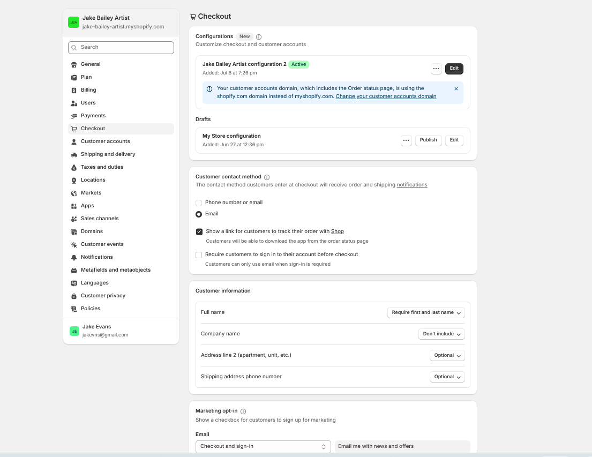
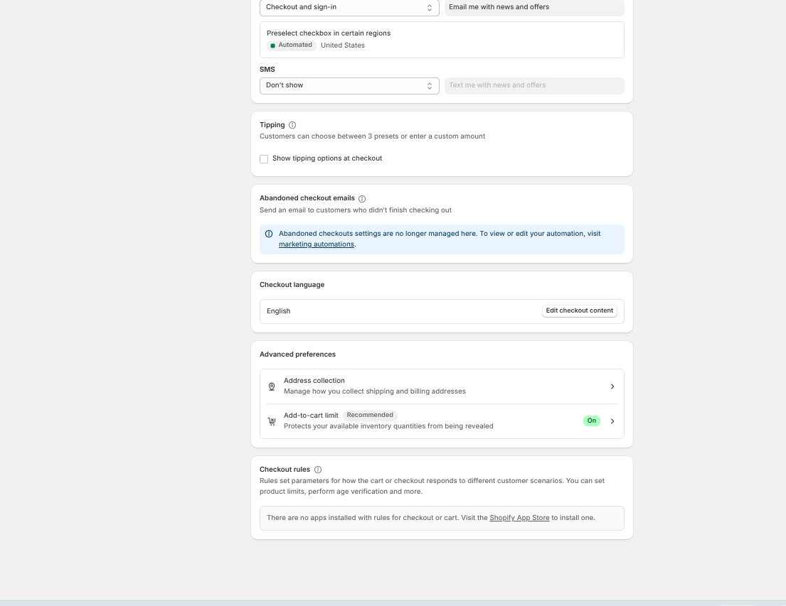
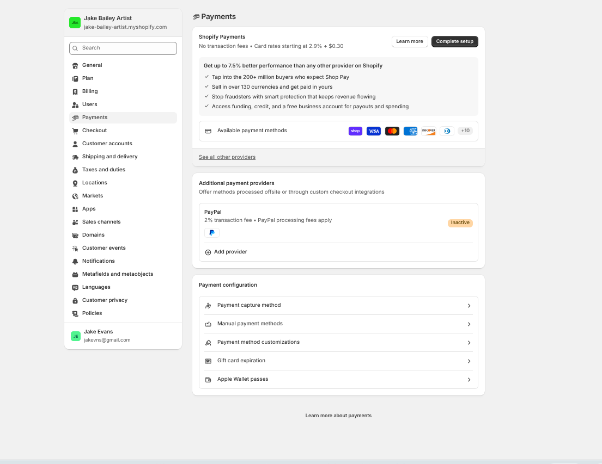
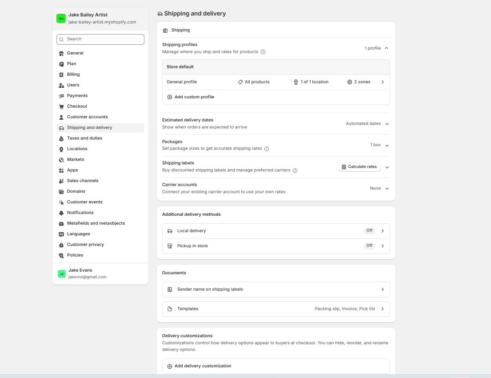
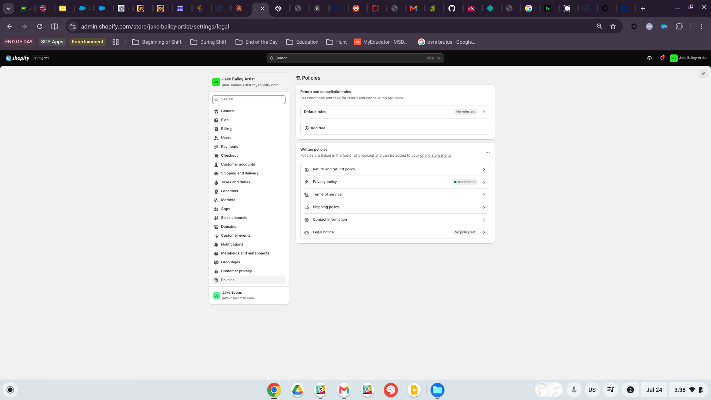
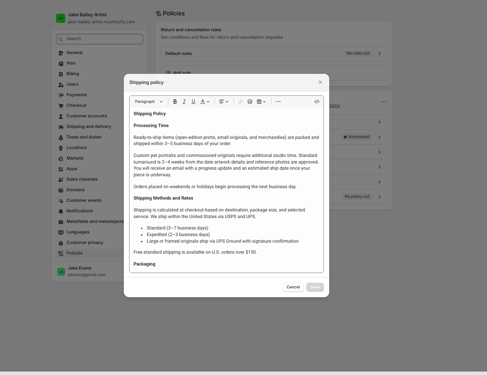
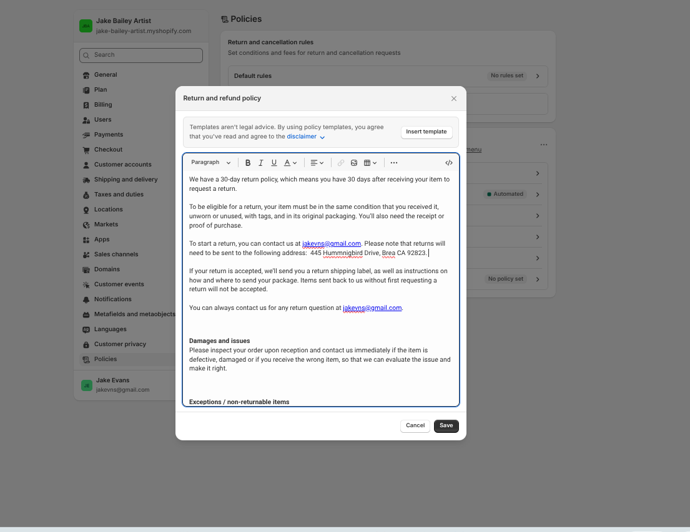
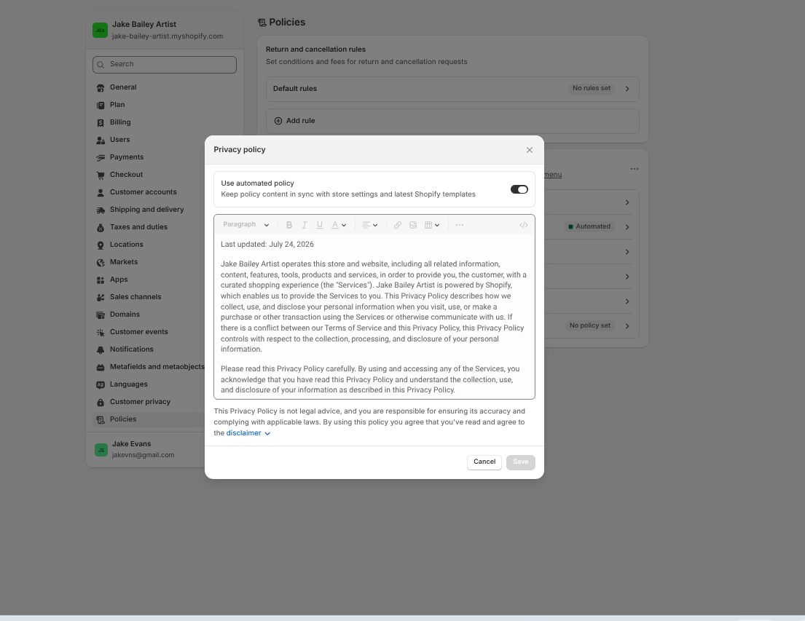
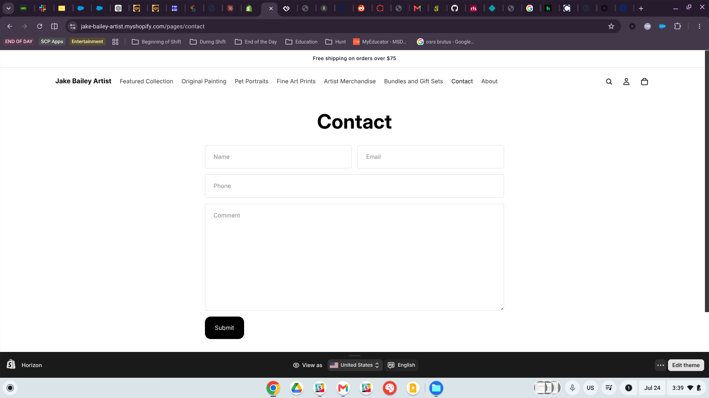

# Introduction

This report documents the checkout review, store policies, and trust signals I implemented for **Jake Bailey Artist**, my Shopify practice store for IBM 6300. The store offers original paintings, custom pet portraits, fine art prints, and artist merchandise, combining ready-to-ship products with made-to-order commissioned work.

Since no real payments were processed for this assignment, the focus is on the *informational* side of the purchasing decision—the settings, policies, and disclosures customers use to decide whether a small independent art store feels safe and trustworthy. Each section explains what I reviewed or created and includes supporting evidence from the Shopify admin and live storefront.

```{r}
#| label: tbl-summary
#| tbl-cap: "Trust and checkout elements addressed in this assignment"
#| message: false
#| warning: false

deliverables <- data.frame(
  Element = c("Checkout settings",
              "Payment settings",
              "Shipping and delivery settings",
              "Shipping and pickup information",
              "Return and refund policy",
              "Privacy policy",
              "Contact information"),
  Location = c("Settings > Checkout",
               "Settings > Payments",
               "Settings > Shipping and delivery",
               "Settings > Policies > Shipping policy",
               "Settings > Policies > Return and refund policy",
               "Settings > Policies > Privacy policy",
               "Online Store > Pages > Contact"),
  Status = c("Reviewed",
             "Reviewed (not activated)",
             "Reviewed",
             "Drafted and published",
             "Drafted and published",
             "Generated and published",
             "Live on storefront")
)

knitr::kable(deliverables)
```

# Checkout Review Evidence

## Checkout Settings

The **Settings → Checkout** page was reviewed in full. The store currently has two saved checkout configurations, with *Jake Bailey Artist configuration 2* set as the active version. The **customer contact method** is set to **Email**, so order confirmations and shipping updates are sent to the customer’s email address instead of by text message. This makes sense for an art store because commissioned pieces may require longer production updates, detailed instructions, or image attachments that are easier to manage through email.

{#fig-checkout1}

Scrolling further down the same page, the following checkout behaviors were reviewed:

- **Marketing consent** — The “Email me with news and offers” option is preselected in certain regions, including the United States, while SMS marketing is not offered during checkout.

- **Tipping** — Tipping options are turned off, which makes sense for a product-based art store rather than a service business.

- **Abandoned checkout emails** — These are now managed through Shopify’s marketing automations instead of the checkout settings page.

- **Checkout language** — The checkout language is set to English.

- **Address collection** — Address settings were reviewed under advanced preferences because accurate shipping information is especially important when sending fragile artwork.

- **Add-to-cart limit** — Shopify’s recommended setting is enabled, which prevents customers from seeing the exact quantity of available inventory. This is particularly useful for a store that sells one-of-a-kind original pieces.

- **Checkout rules** — No apps with cart or checkout rules are installed, so there are currently no product limits, age-verification requirements, or other special checkout restrictions.

{#fig-checkout2}

## Payment Settings

The **Settings → Payments** page was reviewed without activating a payment provider, as required by the assignment. Shopify Payments is available but has not been set up, while PayPal appears as an additional provider with an **Inactive** status. I also reviewed the available payment settings, including payment capture, manual payment methods, payment customizations, gift card expiration, and Apple Wallet passes.

Reviewing this page is still important from a customer-trust perspective because the payment options shown at checkout can strongly influence whether a store feels legitimate. Familiar names and badges such as Shop Pay, PayPal, and major credit card networks give customers confidence by connecting an unfamiliar small business with payment brands they already know and trust. This type of borrowed credibility is especially valuable for an independent artist selling online.

{#fig-payments}

## Shipping and Delivery Settings

The **Settings → Shipping and delivery** page was also reviewed. The store currently uses one **General profile** that covers all products and ships from **1 of 1 location** across **2 shipping zones**. Estimated delivery dates are set to **automated**, so customers can see an expected arrival window during checkout instead of having to guess. The package settings include one box size, and shipping labels are configured to calculate rates rather than use a connected carrier account.

The two additional delivery options, **local delivery** and **pickup in store**, are currently turned off while the appointment-based pickup process described in @sec-shipping is finalized. It makes more sense to clearly document how pickup will work in the shipping policy before enabling it at checkout. Offering pickup before the process is ready could create confusion and broken expectations, which would damage customer trust after the sale.

{#fig-shipping-settings}

## Policies Overview

All written policies are managed under **Settings → Policies**. Shopify automatically links these policies in the checkout footer, and they can also be added to the store’s navigation menu. The policies page includes the return and refund policy, privacy policy, terms of service, and shipping policy. Return and cancellation options are available, but no automated rules have been created because returns involving original artwork need to be reviewed on a case-by-case basis.

{#fig-policies}

# Shipping and Pickup Information {#sec-shipping}

The following shipping policy was written and published under **Settings → Policies → Shipping policy**. It was designed specifically for an art store, where fulfillment looks very different from standard retail. Ready-to-ship prints and made-to-order commissions follow different timelines, while fragile original artwork requires clear information about packaging and handling that most retailers do not need to explain.

::: {.callout-note appearance="simple"}
## Shipping Policy — Jake Bailey Artist

**Processing Time**

Ready-to-ship items (open-edition prints, small originals, and merchandise) are packed and shipped within 3–5 business days of your order.

Custom pet portraits and commissioned originals require additional studio time. Standard turnaround is 2–4 weeks from the date artwork details and reference photos are approved. You will receive an email with a progress update and an estimated ship date once your piece is underway.

Orders placed on weekends or holidays begin processing the next business day.

**Shipping Methods and Rates**

Shipping is calculated at checkout based on destination, package size, and selected service. We ship within the United States via USPS and UPS.

- Standard (3–7 business days)
- Expedited (2–3 business days)
- Large or framed originals ship via UPS Ground with signature confirmation

Free standard shipping is available on U.S. orders over \$75.

**Packaging**

All work is packed to studio standards. Prints ship flat in rigid mailers with acid-free backing or rolled in heavy-duty tubes depending on size. Original paintings are wrapped in glassine, corner-protected, and double-boxed. Framed pieces ship with corner guards and foam padding.

**Local Pickup**

Local pickup is available for customers in the Los Angeles area at no charge. Pickup is arranged by appointment; you will receive an email when your order is ready, typically within 2–3 business days, and should bring your order confirmation and a photo ID.

**Tracking**

A tracking number is emailed to you as soon as your order ships. Please allow up to 24 hours for tracking to update with the carrier.

**Damaged or Lost Shipments**

If your artwork arrives damaged, contact us within 7 days of delivery at jakevns\@gmail.com with photographs of the packaging and the piece. Damaged originals and prints will be replaced or refunded.

If a package is confirmed lost in transit by the carrier, we will file a claim and send a replacement or issue a full refund. We are not responsible for packages marked delivered by the carrier but reported missing; please ensure your shipping address is secure.

**International Orders**

International shipping is available on request for select items. Customers are responsible for all duties, customs fees, and import taxes assessed by the destination country. Contact us at jakevns\@gmail.com before ordering for a shipping quote.

**Address Accuracy**

Please double-check your shipping address at checkout. We are not able to reroute packages once they have shipped, and re-shipping costs for undeliverable addresses are the customer's responsibility.

**Questions**

Email jakevns\@gmail.com and we will respond within 1–2 business days.
:::

{#fig-shipping-policy}

Three decisions in this policy are deliberate trust choices rather than boilerplate. First, the **split processing time** sets a separate expectation for commissions instead of hiding a four-week wait behind a generic "3–5 business days," which is the single most common source of post-purchase complaints for made-to-order sellers. Second, the **packaging section** exists only because the product is fragile and irreplaceable; describing glassine, corner protection, and double-boxing signals craft competence and directly answers the unspoken question "will this arrive intact?" Third, the **free shipping threshold of \$75** matches the announcement bar already running on the storefront, so the promise a customer sees on the homepage is the same promise the policy makes.

# Return and Refund Policy

The following return and refund policy was published to **Settings → Policies → Return and refund policy**, adapted from Shopify's template.

::: {.callout-note appearance="simple"}
## Return and Refund Policy — Jake Bailey Artist

We have a 30-day return policy, which means you have 30 days after receiving your item to request a return.

To be eligible for a return, your item must be in the same condition that you received it, unworn or unused, with tags, and in its original packaging. You'll also need the receipt or proof of purchase.

To start a return, you can contact us at jakevns\@gmail.com. Please note that returns will need to be sent to the following address: 445 Hummingbird Drive, Brea, CA 92823.

If your return is accepted, we'll send you a return shipping label, as well as instructions on how and where to send your package. Items sent back to us without first requesting a return will not be accepted.

You can always contact us for any return question at jakevns\@gmail.com.

**Damages and issues**

Please inspect your order upon reception and contact us immediately if the item is defective, damaged, or if you receive the wrong item, so that we can evaluate the issue and make it right.

**Exceptions / non-returnable items**

Certain types of items cannot be returned, like perishable goods (such as food, flowers, or plants), custom products (such as special orders or personalized items), and personal care goods (such as beauty products). We also do not accept returns for hazardous materials, flammable liquids, or gases. Please get in touch if you have questions or concerns about your specific item.

Unfortunately, we cannot accept returns on sale items or gift cards.

**Exchanges**

The fastest way to ensure you get what you want is to return the item you have, and once the return is accepted, make a separate purchase for the new item.

**European Union 14-day cooling off period**

Notwithstanding the above, if the merchandise is being shipped into the European Union, you have the right to cancel or return your order within 14 days, for any reason and without a justification. As above, your item must be in the same condition that you received it, unworn or unused, with tags, and in its original packaging. You'll also need the receipt or proof of purchase.

**Refunds**

We will notify you once we've received and inspected your return, and let you know if the refund was approved or not. If approved, you'll be automatically refunded on your original payment method within 10 business days. Please remember it can take some time for your bank or credit card company to process and post the refund too.

If more than 15 business days have passed since we've approved your return, please contact us at jakevns\@gmail.com.
:::

{#fig-refund-policy}

The most important clause for this store is the **custom products exception**. A commissioned pet portrait cannot be resold to anyone else, so accepting open-ended returns on personalized work is not viable for a small studio. The policy handles this the way the Google Merchant Center requirements framed it in the Shopping Ads coursework: what matters for trust is not that a policy be generous, but that it be **clearly disclosed before purchase**. A customer who knows upfront that a commission is final can still buy with confidence; a customer who discovers it during a dispute cannot.

The 30-day window, the return address, the named refund timeline of 10 business days, and the escalation path if 15 business days pass all convert a vague promise into a checkable commitment. Specificity is what makes a policy read as real rather than as legal decoration.

# Privacy Policy and Customer Data Statement

A full privacy policy was generated through Shopify's automated policy tool and published to **Settings → Policies → Privacy policy**, last updated **July 24, 2026**. Because the store is powered by Shopify, the policy documents both what Jake Bailey Artist collects and how Shopify processes data as the hosting platform.

{#fig-privacy-policy}

## Customer Data Statement (Plain-Language Summary)

The full policy is long by necessity. The following short statement summarizes it in language a customer will actually read, and is intended for placement near the contact form and checkout:

::: {.callout-note appearance="simple"}
## How We Handle Your Information

We collect only what we need to fulfill your order and support you afterward: your name, email, shipping and billing address, phone number if you provide one, and the details of what you ordered. Payment card information is processed securely by Shopify and our payment providers — we never see or store your full card number.

We use your information to process and ship your order, send order and shipping notifications, respond to your questions, and prevent fraud. If you opt in, we also use your email to send occasional updates about new work and releases. You can unsubscribe from marketing email at any time using the link in any message; you will still receive transactional email about orders you have placed.

We do not sell your personal information. We share it only with the service providers who help us operate the store — Shopify, our payment processors, and our shipping carriers — and only as needed to complete your order.

Depending on where you live, you may have the right to access, correct, delete, or receive a copy of the personal information we hold about you, and to opt out of the sharing of your information for targeted advertising. To exercise any of these rights, or to ask a question about how your data is handled, email jakevns\@gmail.com.
:::

The key categories disclosed in the full policy are summarized below.

```{r}
#| label: tbl-privacy
#| tbl-cap: "Summary of personal information collected and its purpose"

privacy <- data.frame(
  Category = c("Contact details",
               "Financial information",
               "Account information",
               "Transaction information",
               "Communications",
               "Device and usage information"),
  Purpose = c("Order fulfillment, shipping, and customer notifications",
              "Payment processing, handled by Shopify and payment providers",
              "Account management, preferences, and saved settings",
              "Order history, returns, exchanges, and recommendations",
              "Customer support and issue resolution",
              "Site security, fraud prevention, and site improvement")
)

knitr::kable(privacy)
```

# Contact Information

A **Contact** page is live on the storefront at `/pages/contact` and is linked directly in the main navigation menu alongside Featured Collection, Original Painting, Pet Portraits, Fine Art Prints, Artist Merchandise, Bundles and Gift Sets, and About. The page uses Shopify's built-in contact form with fields for name, email, phone, and message.

{#fig-contact}

A contact form on its own answers *how* to reach the store but not *whether anyone will answer*. The following contact section copy was drafted to sit above the form, converting a blank form into a stated service commitment:

::: {.callout-note appearance="simple"}
## Contact Jake Bailey Artist

**Questions about an order, a commission, or a piece you're considering?** Send a message using the form below and you'll hear back within 1–2 business days.

**Email:** jakevns\@gmail.com

**Studio location:** Brea, California — local pickup and commission consultations available by appointment.

**Commission inquiries:** Include your subject, your preferred size, and any deadline you're working toward. Reference photos can be sent by email after we connect.

**Response times:** Messages are answered Monday through Friday. Inquiries received over the weekend are answered on the next business day.

**Order support:** Have your order number ready and we can look up shipping status, tracking, or return options right away.
:::

Adding a clear response window, direct email address, geographic location, and explanation of what happens next removes much of the uncertainty customers often feel when submitting a contact form. Instead of wondering whether their message will be seen, they know when to expect a reply and how the process will move forward. It also gives commission customers a simple, structured way to begin the conversation, shortening the path from initial interest to a completed sale.

# Trust Signals Reflection

Taken together, these policies and store details reduce the uncertainty that can stop customers from purchasing from an unfamiliar independent business. Online shoppers cannot inspect a painting in person, confirm that the studio is legitimate, or know how the seller will handle a problem, so they rely on the information available throughout the website. When that information is missing, customers may assume the worst. The shipping policy answers “When will this actually arrive?” by providing a clear processing window, a separate timeline for commissioned work, tracking for every order, and an explanation of how fragile artwork is packaged. The return policy answers “What happens if something goes wrong?” with a 30-day return window, a stated refund timeline, and a clear exception for custom pieces. The privacy policy also addresses concerns about sharing personal and payment information with a small seller by explaining that card details are processed securely through Shopify rather than stored by the artist. The contact page adds another layer of trust by providing a real email address, studio location, and 1–2 business day response window, showing that an actual person stands behind the store and can be reached when needed. Consistency is just as important as having these policies in place: the free-shipping threshold in the announcement bar matches the shipping policy, and the same contact information appears throughout the store. Each detail may seem small on its own, but together they shift the store from feeling like an unknown seller online to a legitimate working studio that has carefully planned what happens after a customer clicks **Buy**.

# CPP Farm Store Application Reflection

For the CPP Farm Store, the most important trust signals are the ones connected to **freshness, pickup logistics, and institutional credibility**. These priorities are different from those of an art store because the products are perishable and the fulfillment process is mainly local. Clear pickup information is probably the most important signal. Customers need to know exactly where on campus to pick up their order, which time windows are available, how long the order will be held, how they will be notified when it is ready, and what happens if an item is unavailable at harvest time. Since inventory depends on what is actually harvested rather than what is sitting in a warehouse, the store should also explain its substitution and out-of-stock policies upfront. That way, a customer who orders strawberries and receives a substitute or refund will understand the process instead of being surprised.

Freshness and product-handling information should also be easy to find. Details such as harvest dates, “picked this week” labels, food-safety and cold-storage practices, and honest photos of the actual products would support the Farm Store’s main promise that its produce is fresher than what customers may find at a supermarket. The return and refund policy should also be written specifically for perishable goods rather than copied from a standard retail template. Since returning food is usually unrealistic, the policy should instead offer a refund or replacement for quality concerns reported within a short period. The Farm Store’s strongest trust signal is its connection to Cal Poly Pomona. The university affiliation, student-grown and learn-by-doing story, campus contact information, staffed hours, and physical store address all help turn an unfamiliar online storefront into a real local business that customers can verify and visit. Finally, visible payment security, a clear privacy statement, and a responsive contact channel with posted hours can help turn a one-time seasonal purchase into the kind of ongoing customer relationship our omnichannel strategy is designed to build.

# Conclusion

This assignment moved the Jake Bailey Artist store beyond simply having functional checkout settings by creating a complete, consistent, and customer-facing layer of trust. I reviewed the checkout, payment, and shipping settings without processing any real transactions, drafted or generated the shipping, return, and privacy policies, published them to the storefront, and reviewed the live contact page with expanded copy to make the process clearer for customers. The same principles apply directly to the CPP Farm Store consulting project: explain fulfillment timelines before purchase, write policies that fit the actual product category, keep information consistent across every part of the store, and make sure customers can easily reach a real person. These practices are even more important for the Farm Store because perishable products and campus pickup create additional questions that must be answered before customers feel comfortable placing an order.

# Appendix

## Live Store

- **Storefront:** <https://jake-bailey-artist.myshopify.com>
- **Contact Page:** <https://jake-bailey-artist.myshopify.com/pages/contact>

## Published Report

- **GitHub Pages:** <https://jakevns.github.io/RStudio/A6/Evans%2CJake-IBM6300-A6.html>

## Repository

- **GitHub Repo:** <https://github.com/jakevns/RStudio/tree/main/A6>
