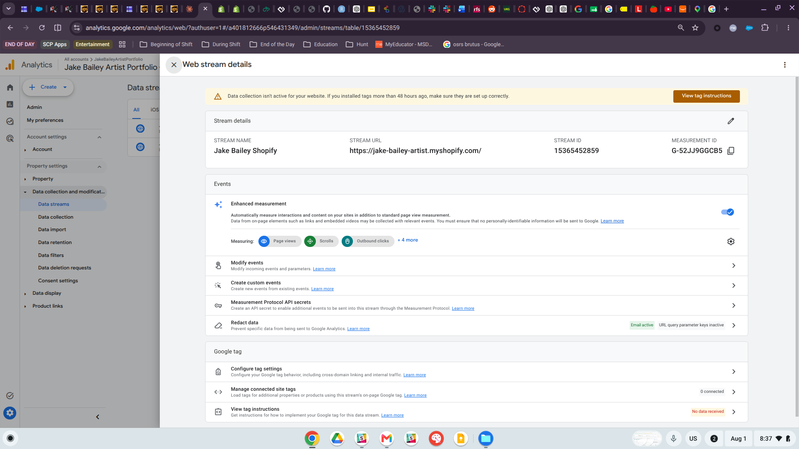
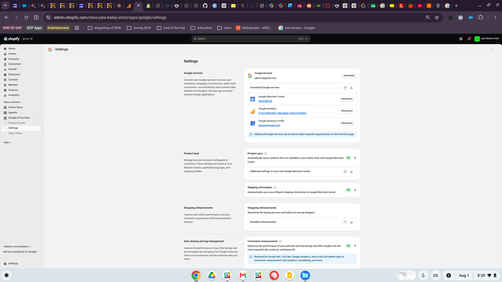
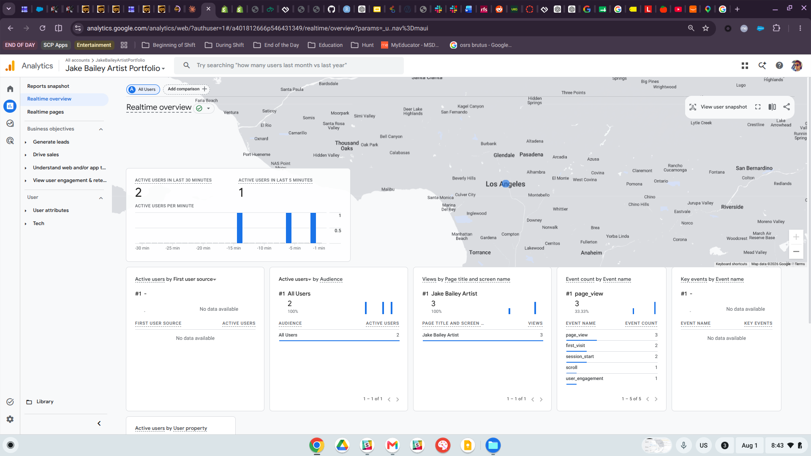
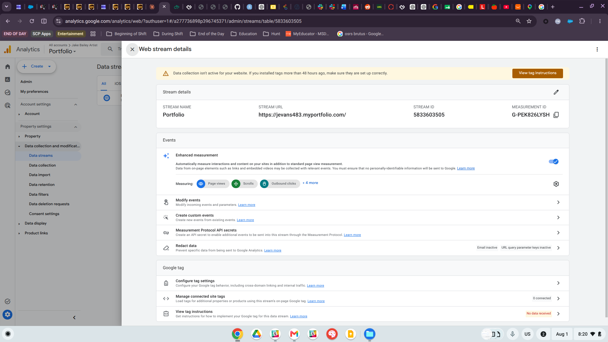
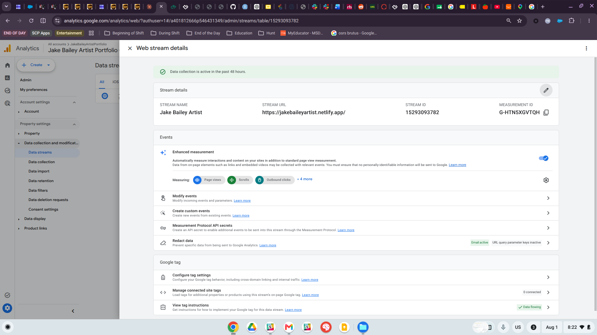

## Purpose

This report documents the process of connecting a Google Analytics 4 (GA4) property to a Shopify practice store, following the same workflow used in the Digital Marketing course and applying it to an e-commerce platform. GA4 allows retailers to understand customer behavior, traffic sources, product interest, and online shopping activity, which will be valuable in evaluating how customers interact with the CPP Farm Store storefront later in the term.

## GA4 Property and Web Stream Evidence

A dedicated GA4 web data stream, **"Jake Bailey Shopify,"** was created under the existing "Jake Bailey Artist Portfolio" GA4 property, pointed specifically at the Shopify practice store URL (`https://jake-bailey-artist.myshopify.com/`). This gave the Shopify store its own unique Measurement ID (**G-52JJ9GGCB5**), separate from other web properties already tied to this Google account.

## Shopify Connection Evidence

The Shopify store was connected to GA4 using Shopify's built-in **Google & YouTube** sales channel app. After signing into the associated Google account, the app's Settings page confirms three connected Google services, including Google Analytics linked directly to the **G-52JJ9GGCB5 (Jake Bailey Artist Portfolio)** stream created above.

## Analytics Evidence

To confirm the connection was functioning, the live Shopify storefront was visited from two separate devices (desktop and phone). The GA4 Realtime Overview report picked up both sessions, showing 2 active users in the last 30 minutes and a live event stream including `page_view`, `first_visit`, `session_start`, `scroll`, and `user_engagement` events, all attributed to the "Jake Bailey Artist" page title.

## Technical Issue Documentation

Setting up this integration was not immediate, and the process surfaced a real troubleshooting scenario worth documenting.

This Google account has multiple GA4 web streams tied to unrelated properties, including one connected to a **myportfolio.com** site (from an earlier art portfolio setup) and one connected to a **Netlify-hosted** version of the Jake Bailey Artist website (set up during an earlier lecture on Google Analytics, unrelated to this course). When first attempting to verify the Shopify connection, the wrong stream was checked, which showed a "Data collection isn't active" warning because that particular stream's Measurement ID was never installed on the Shopify store at all — it belonged to the myportfolio.com site.

A second stream, tied to the Netlify-hosted site, was actively collecting data, which initially looked like a successful Shopify connection but was in fact unrelated traffic from the portfolio site.

Once this was identified, the fix was straightforward: create a brand-new GA4 web stream scoped specifically to the Shopify store's own URL, generate its unique Measurement ID, and reconnect Shopify to that ID via the Google & YouTube app rather than reusing an ID from an unrelated site. After this correction, Realtime data began populating within minutes of visiting the live Shopify storefront.

**Takeaway:** when a Google account manages multiple properties for the same brand name, it is easy to mix up which GA4 stream is actually wired to which website. Creating a stream with a clear, purpose-specific name (e.g., "Jake Bailey Shopify") and double-checking the Stream URL field before troubleshooting saved significant time.

## CPP Farm Store Analytics Reflection

Applying this same GA4-to-Shopify setup to the CPP Farm Store project would give the group meaningful visibility into customer behavior across the storefront. GA4 could track which product categories (produce, dairy, prepared foods, etc.) draw the most page views and how customers navigate between the homepage, category pages, and individual product listings, revealing which "Fresh This Week" items generate the most interest. Event tracking could capture add-to-cart actions and checkout starts versus completions, helping the team identify where shoppers drop off in the funnel. Traffic source data would show whether customers are arriving through organic search, direct visits, or referral traffic from campaign assets like the AI-generated creative from GP5, which would help the group evaluate whether their marketing efforts are actually driving store visits. Shopify's native analytics could supplement this with conversion and sales data tied directly to specific products, giving the group a fuller picture of which farm store offerings perform best and where the customer journey could be improved.

## Appendix

- **GitHub Repository:** [https://github.com/jakevns/RStudio](https://github.com/jakevns/RStudio)
- **GitHub Pages (this report):** [https://jakevns.github.io/RStudio/A7/Evans%2CJake-IBM6300-A7.html](https://jakevns.github.io/RStudio/A7/Evans%2CJake-IBM6300-A7.html)
