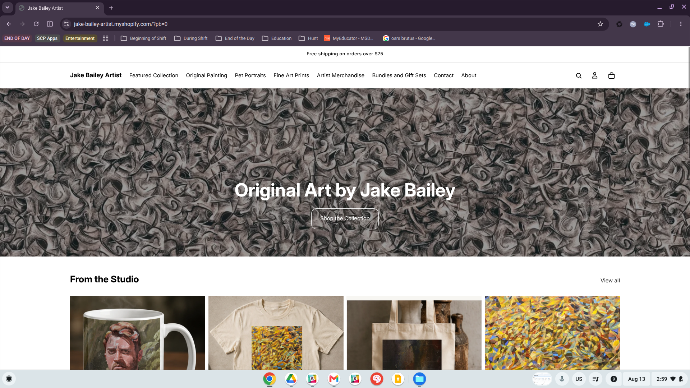
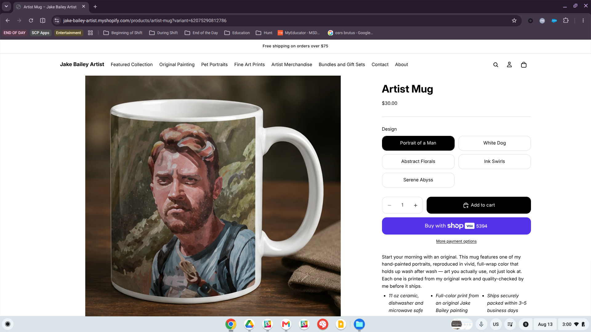
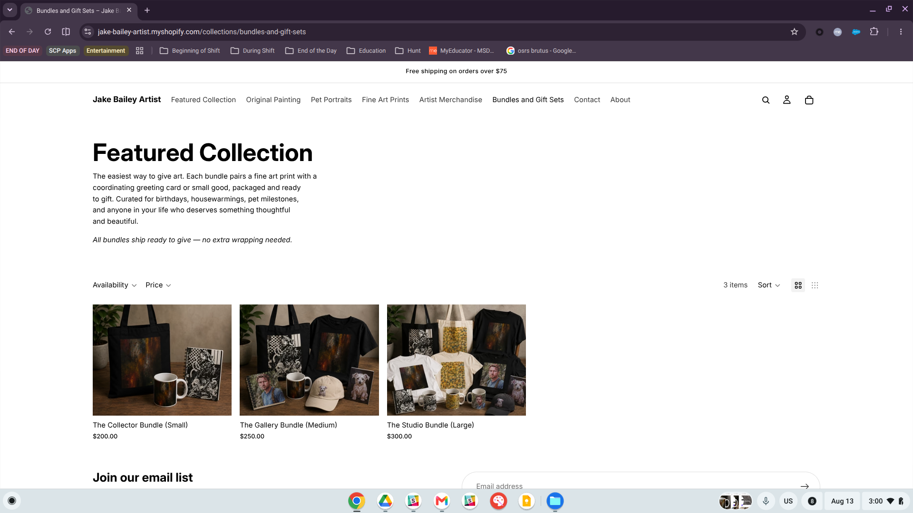
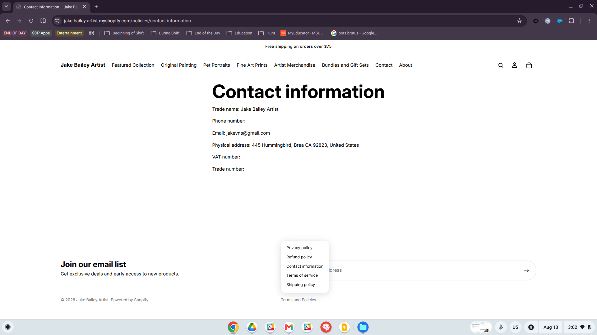
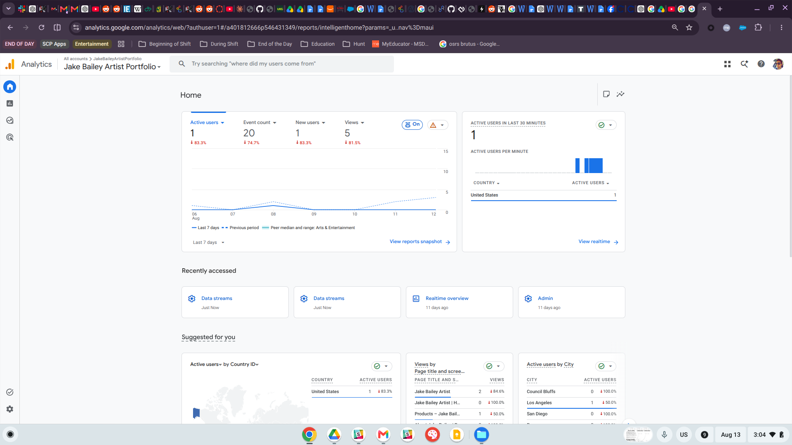
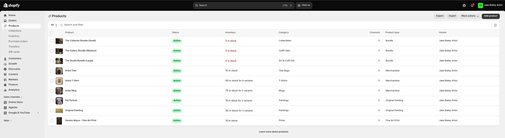

# Store Overview

My practice store, **Jake Bailey Artist** (`jake-bailey-artist.myshopify.com`), is a Shopify extension of my real art brand, [jakebaileyartist.com](https://jakebaileyartist.com). The idea is to give people a few different ways to own and enjoy my artwork, depending on what they like and how much they want to spend. That could mean buying an original painting or fine art print, ordering a custom pet portrait, or choosing something more practical—like a mug, tote, or T-shirt—with one of my designs on it.

**Target customer:** I designed the store around two customer groups that overlap with each other. The first is the *art collector*, who is willing to spend more on an original painting or limited fine art print because a specific piece really speaks to them. The second is the *casual fan or gift buyer*. They may love my style but want something at a more affordable price, such as a mug, hat, or tote. This group also includes people looking for a personal gift, which is where the custom pet portraits fit in.

**Product assortment:** The catalog reflects those two types of customers through the Featured Collection, Original Painting, Pet Portraits, Fine Art Prints, Artist Merchandise, and Bundles and Gift Sets collections. I created the Bundles and Gift Sets collection to help connect the higher-end artwork with the more affordable merchandise. The three options (Collector, Gallery, and Studio) each pair a fine art print with matching merchandise at different price points (\$200, \$250, and \$300). This gives customers an easy, gift-ready option without making them choose and match every item themselves.

# Final Store Evidence

## Homepage

The homepage opens with a full-bleed hero image, the headline “Original Art by Jake Bailey,” and a clear “Shop the Collection” button. Directly below it, the “From the Studio” product section gives new visitors an immediate look at the range of artwork and products available in the store.

## Product Page

The Artist Mug listing shows how I handle one product with several design options. Customers can choose from five designs (Portrait of a Man, White Dog, Abstract Florals, Ink Swirls, and Serene Abyss) on the same product page instead of having to browse five separate listings. When a customer selects a design, the product image updates to show that specific version. The description also reinforces the idea of “art you actually use,” while simple bullet points covering the mug’s materials and expected shipping time give customers the practical information they need before ordering.

## Collection Page

The Bundles and Gift Sets collection brings all three gift tiers together on one page. A short introduction describes the bundles as “the easiest way to give art,” while also letting customers know that each one arrives ready to give. I kept the availability and price filters even though the collection only has three products, so the page stays consistent with the larger collections throughout the store.

## Navigation Menu

The main navigation moves from higher-end artwork to more affordable products, starting with Featured Collection, Original Painting, Pet Portraits, and Fine Art Prints before moving into Artist Merchandise and Bundles and Gift Sets. Contact and About come at the end. I intentionally limited the menu to eight items so the header stays clean and does not wrap onto another line on smaller screens.

## Policy / Contact Information

The Contact page includes my business name, email address, and mailing address, along with links to all of the store’s policies: Privacy Policy, Refund Policy, Contact Information, Terms of Service, and Shipping Policy. I started with Shopify’s automatically generated policy templates and then edited each one to match my store.

## GA4 / Shopify Analytics Evidence

The store is connected to Google Analytics 4 through the “Jake Bailey Artist Portfolio” property (Measurement ID `G-52JJ9GGCB5`). This lets me track active users, views, and event activity over the last seven days, while the real-time reports show where current visitors are coming from by country and city.

The Shopify admin catalog shows all nine active product listings. These include three bundles, three merchandise items, and three art products: Pet Portrait, Original Painting, and Serene Abyss Fine Art Print. Each listing is currently published across five sales channels.

# Retail Technology Reflection

Building this store from start to finish changed the way I think about Shopify. Before this project, I assumed most of the work would be designing the storefront, choosing a theme, and writing product descriptions. In reality, the part that required the most thought and revision was the *backend structure*. Products, variants, collections, and navigation all have to work together before the storefront makes sense to the customer. For example, the Artist Mug is not simply one product listing with five images. Each design is its own inventory and pricing decision, and Shopify’s variant system makes those options manageable without forcing me to create five nearly identical product pages.

I also gained a much better understanding of Shopify as more than just a “website builder.” The platform handles policies, checkout, payment processing through Shop Pay, shipping rules, and analytics integrations as core parts of the store. That connects directly to the CPP Farm Store project because it needs the same kind of behind-the-scenes infrastructure, not just a website that looks good.

# Merchandising Reflection

The biggest merchandising lesson I learned is that **collections are a merchandising decision, not just a way to organize products.** At first, I separated everything by product type, such as paintings, prints, and merchandise. When I created the Bundles and Gift Sets collection, I started organizing around *why* someone was shopping instead. A customer looking for a gift has a different goal than someone searching for a print for their wall, even if they might end up buying some of the same products. That shift in thinking led me to combine a \$30 mug with a \$150 print in a \$200 gift package rather than expecting customers to put the bundle together themselves.

The navigation and storefront design also taught me the value of keeping things simple. My first navigation bar had eleven items, but it felt crowded and made the store harder to understand at a glance. I reduced it to eight items and grouped the merchandise into fewer collections. This made the site easier to scan and helped first-time visitors understand what I sell within a few seconds of arriving.

# Analytics Reflection

Connecting GA4 to the store made the idea of “traffic” feel much more real. Seeing active users, events, and page views update almost in real time showed me how much I can learn about customers before they ever place an order. I can see which pages people visit, where they are located, and which products receive attention compared with the ones they scroll past or ignore. Shopify’s built-in analytics focuses more on the transaction side, such as orders, revenue, and conversions. GA4 adds more context by showing what customers do throughout the entire visit, not only what happens at checkout.

My biggest practical takeaway is that analytics needs to be set up *before* the data is needed. If GA4 is not connected from the beginning, there is no way to go back later and recover what those early visitors did. That is something I will carry into future e-commerce projects: set up the tracking first, then launch the store.

# CPP Farm Store Application

Working on my own store showed me at least three clear ways these skills apply to the CPP Farm Store consulting project:

1.  **Organize collections around customer intent, not only product categories.** I created the Bundles and Gift Sets collection around the goal of gift-giving rather than a single product type. CPP Farm Store could take the same approach by organizing its catalog around common shopping needs, such as “weekly produce,” “farm-to-table gift boxes,” or “campus pickup,” instead of presenting customers with one long list of products. This connects directly to the omnichannel journey mapping and campaign planning Seis Leches developed in GP1 and GP4.

2.  **Use variants to manage seasonal and perishable products.** My Artist Mug listing uses five design variants under one product rather than five separate listings. CPP Farm Store could use a similar structure for seasonal products with options such as bunch size, organic versus conventional, or different weekly box contents. This would keep the catalog from becoming cluttered with duplicate listings and make it easier to update as products change from week to week.

3.  **Use GA4 to guide merchandising decisions, not just meet a reporting requirement.** Connecting GA4 to my store allowed me to see which pages and products were actually getting attention. CPP Farm Store should use the GA4 and Looker Studio dashboard our team created in GP6 in the same way. For example, the team could check whether campaigns like “Fresh This Week—Grown at Cal Poly Pomona” are sending customers to the intended collections. If they are not, the store’s merchandising, campaign messaging, or navigation can be adjusted instead of treating the dashboard as a one-time class deliverable.

# Final Self-Assessment

\***What I’m proud of:** I’m most proud of the Bundles and Gift Sets collection because it is where the merchandising strategy goes beyond simply making the store look good. It solves a real customer problem: how to give someone art as a gift without having to choose and combine every item yourself. It also brings products from different parts of the catalog together in a way that feels intentional rather than allowing each collection to exist on its own.

**What I’d improve with more time:** I would focus on improving the product photography and adding more lifestyle images. Most of my current product photos are clean, but they are also fairly static and use white or neutral backgrounds. With more time, I would photograph the mugs, totes, and shirts in real-life settings so customers could better picture themselves using them. This would make the merchandise listings feel more engaging and bring them closer to the visual quality of the original painting and fine art print listings.

# Appendix

- **GitHub Pages:** [https://jakevns.github.io/RStudio/A9/Evans%2CJake-IBM6300-A9.html](https://jakevns.github.io/RStudio/A9/Evans%2CJake-IBM6300-A9.html)
- **GitHub Repository:** [https://github.com/jakevns/RStudio/tree/main/A9](https://github.com/jakevns/RStudio/tree/main/A9)
