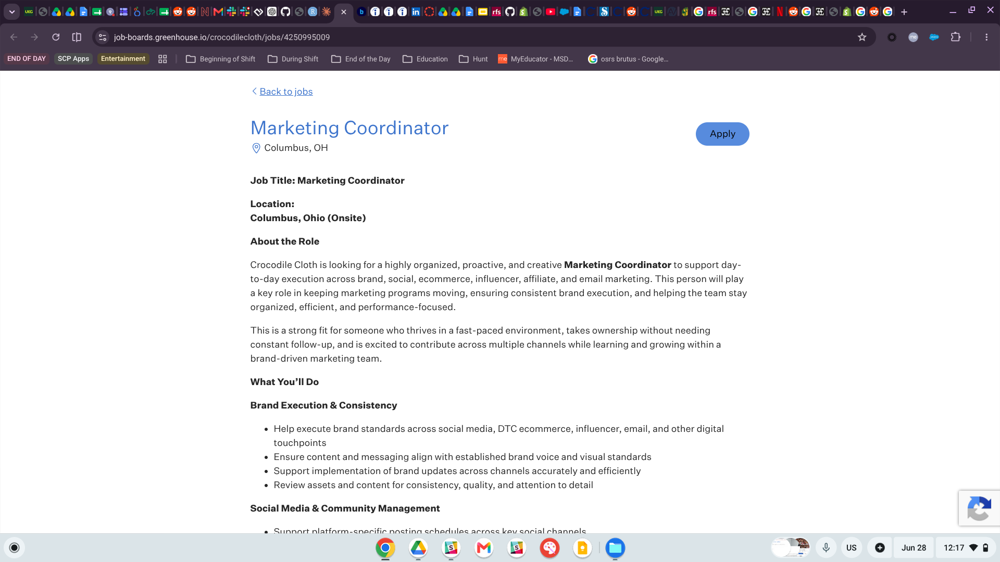
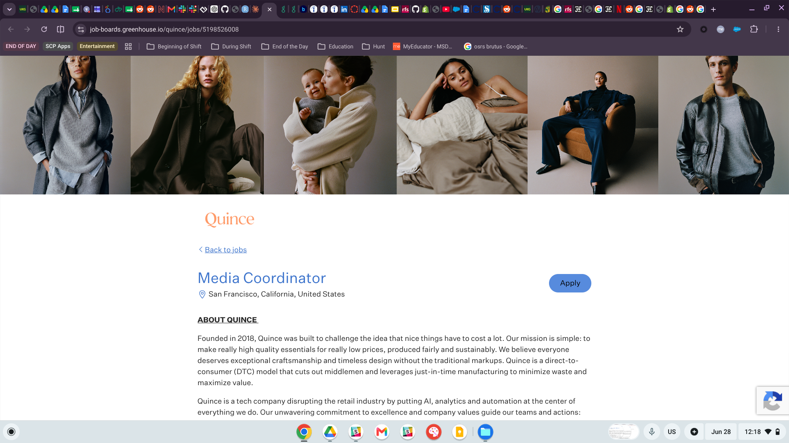
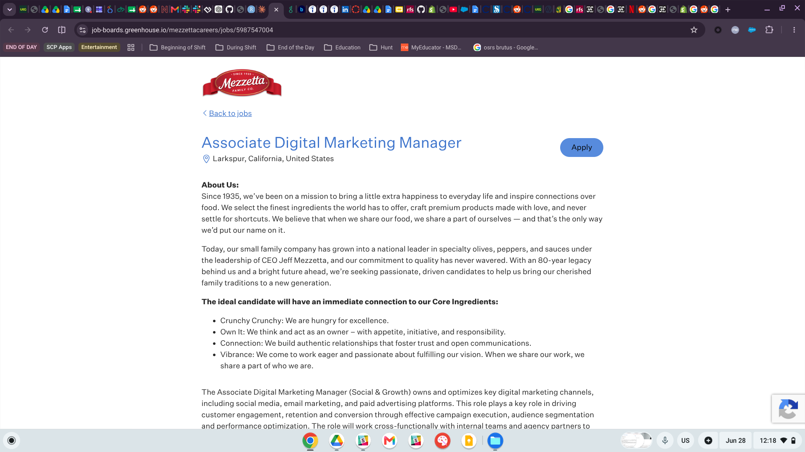

## Introduction

The retail industry no longer exists in a single place, no longer chained by the burden of having to visit a physical location. Today, customers can discover products via social media (Instagram, Tiktok, Facebook, etc), research on a brands website, comparing prices through Google Shopping ads, all while still having the option to physically pick it up curbside, on location. This connected shopping journey is what has defined **omnichannel retailing**: *coordinating digital platforms, physical stores, data systems, and unfied creative countent to create a seamless customer journey*. For grad students preparing to start careers in marketing or commerce, comprehending how these channels operate has become industry standard.

As a visual artist and an MSDM student (with a background in digital design) and is in the process of creating an active Shopify storefront at [jakebaileyartist.com](https://www.jakebaileyartist.com), the omnichannel retail landscape is personal and revelant. The career path I have set for myself sits on the intersection of brand creativty merged with digital marketing execution and logic. These roles require aesthetic judgement in collaboration with data fluency to engage customers in multiple channels. The three job postings I researched are **Marketing Coordinator** at **Crocodile Cloth**, **Media Coordinator** at **Quince**, and **Associate Digital Marketing Manager** at **Mezzetta**; all of which reflect this creative marketing direction. Together they showcase what an early career professional in creative digital marketing is to expected to undertand and what I need to be able to do.

## Summary of Job Postings

### Marketing Coordinator — Crocodile Cloth (Columbus, OH) {#sec-job1}

::: {.callout-note title="Job Posting 1"}
**Company:** Crocodile Cloth \| **Location:** Columbus, OH (Onsite) \| **Source:** Greenhouse\
🔗 [View Posting](https://job-boards.greenhouse.io/crocodilecloth/jobs/4250995009)
:::

{fig-alt="Screenshot of Crocodile Cloth Marketing Coordinator job posting on Greenhouse" width="90%"}

**Crocodile Cloth** is a consumer products brand looking for an organized, proactive, and creative **Marketing Coordinator** to support day to day marketing execution across brand, social media, e-commerce, influencer, affiliate, and email channels. This role is strongly omnichannel focused since it requires someone who can maintain a consistent brand presence across DTC e-commerce, TikTok Shop, Social Media Platforms, email Campaign, and partner based marketing.

The position is a combination of creative work and operational support with responsibilities including: managing community engagement, coordinating with influencers/affiliates, assisting with email campaign builds, maintaining marketing calenders, and tracking performance through thorough dashboards. This is why the role is a great example of how modern marketing positions require a combination of creative judgement and strong project management skills.

The job requires **1-3 years of experience** in marketing, social media, e-commerce, or a related field. The ideal candidate is someone who can work independently, managing several project simultaneously, and move seemlessly between creative tasks and execution based workflows. Familiarity with social media platforms, email marketing tools, and e-commerce evironment is especially important; this a long with attention to detail while being willing to take initiative.

------------------------------------------------------------------------

### Media Coordinator — Quince (San Francisco, CA) {#sec-job2}

::: {.callout-note title="Job Posting 2"}
**Company:** Quince \| **Location:** San Francisco, CA \| **Source:** Greenhouse\
🔗 [View Posting](https://job-boards.greenhouse.io/quince/jobs/5198526008)
:::

{fig-alt="Screenshot of Quince Media Coordinator job posting on Greenhouse" width="90%"}

**Quince** is a direct-to-consumer (DTC) fashion brand that challenges the traditional retail space by cutting out the middlemen; offering high quality style essentials with more accessible price points. The company's **Media Coordinator** role sits within the creative team and is a position focused on managing, organizing, and optimizing product imagery across digital media channels.

The Media Coordinator's responsibilities are highly visual and detail oriented; including uploading digital assets into content management systems, making light edits in Adobe Photoshop, checking color accuracy across product families, preparing images for social media, following file naming/metadata standards, and reviewing image quality (resolution, sharpness, and brand consistency).

This role is a strong fit for someone with a visual arts background who is also organized and process oriented. It also shows how important visual asset management has within an omnichannel strategy. Product imagery must be consistent with the brand whether it appears on a website, in a paid ad, on social media, or a print catalog. This role is not just photoshopping images, its ensuring the customer experiences a consistent brand image across every channel.

------------------------------------------------------------------------

### Associate Digital Marketing Manager — Mezzetta (Larkspur, CA) {#sec-job3}

::: {.callout-note title="Job Posting 3"}
**Company:** Mezzetta \| **Location:** Larkspur, CA \| **Source:** Greenhouse\
🔗 [View Posting](https://job-boards.greenhouse.io/mezzettacareers/jobs/5987547004)
:::

{fig-alt="Screenshot of Mezzetta Associate Digital Marketing Manager job posting on Greenhouse" width="90%"}

Mezzetta is an 80 year old, family run specialty food brand that is a national leader in premium olives, peppers, and sauces. Its **Associate Digital Marketing Manager (Social & Growth)** role and is responsible managing/optimizing key digital marketing channels, including: social media, email marketing, and paid advertising. The main goal of the position is to drive customer engagement, retention, and conversion accross all digital touch points.

The role includes owning the integrated social content calender, collaborating with agencies and internal teams on content creation, managing influencer/ambassador relationships, supporting paid social campaigns (on Platform's like Meta and Amazon), tracking performance KPIs, and monitoring trends (Tiktok, Youtube, Pintrest, Reddit).

Of the three roles, this has the highest seniority and is the most stratetegic. It functions as both the brand's digital voice and the operational engine behind campaign execution. The position requires a hybrid of creativity and analytical thinking; someone who can write engaging captions, understand what's trending, and use performance data to decide what content or campaign should come next.

------------------------------------------------------------------------

## Skills and Knowledge Required

::: panel-tabset
### Technical Skills

Within all three job postings, there is a clear pattern of technical skills that appear: they require marketers to move comfortably between creative tools, social media platforms, e-commece systems, all with analytics in mind.

Creative software is especially important, **Adobe Photoshop** and **Creative Suit** skills are direction required for the Quince role and are still relevant to the creative content tasks at Mazzetta. Social media expertise is another major theme across jobs; with platforms such as **TikTok, Instagram, Facebook, Youtube, Pintrest, and Reddit** appearing across the Crocodile Cloth and Mazzetta Postings. These roles expect caniddates that understand, not only how to post content, but also how each platform functions in conjunction with the large customer journey.

The postings also highlight the importance of marketing technology in the modern job market. Crocodile Cloth and Mezzetta both reference email marketing tools such as **Klaviyo, Mailchimp, or similiar platforms,** while Quince focuses heavily on **content management systems and digital asset management**. Paid media experience appears in the Mezzetta role as well, especially with platforms like Meta Ads or Amazon. Across all three roles, analytical reporting skills are expected, including the ability to track KPI's, maintain dashboards, and use performance data to guide decision making.

E-commerce knowledge is a major shared requirement; Crocodile Cloth specifically mentions platforms like **Shopify and TikTok Shop,** while Quince and Mezzetta both operate with DTC buisness models. Taken together, these postings showcase that digital marketing roles require a blended skill set of visual content creation, platform fluency, e-commerce understanding, and the ability to comprehend data.

### Soft Skills

Across all three postings, soft skills are just as important as the technical; each role emphasizes organization, attention to detail, and the ability to multitask multiple roles simultaneously. These skills appear in various ways, from reviewing image quality at Quince to managing an entire content calender at Mezzetta, or maintaining dashboards at Crocodile Cloth. These postings highlight communication and initiative with each role involving collaboration with internal teams, agencies, influencers, or creative partners. This means candidates need to work clearly and take ownership of the role without constant supervision. Overall, these three jobs require marketers who can balance creativity with execution, while understanding how their work supports company performance.

All three postings share a strong emphasis on **organizational skills** and the ability to manage multiple projects and deadlines simultaneously. **Attention to detail** is explicitly called out in every role — whether it is reviewing assets for color accuracy (Quince), maintaining content calendars (Mezzetta), or keeping dashboards accurate (Crocodile Cloth). **Cross-functional communication** is required at all three, as each coordinator must work with internal teams, external agencies, and creative partners. **Proactive ownership** — the ability to move without constant supervision — is a recurring theme, particularly at Crocodile Cloth and Mezzetta. Finally, **creative sensibility** combined with a **performance-driven mindset** characterizes all three roles: employers want marketers who can make beautiful things *and* explain why those things work.

### Key Keywords

The following terms appear consistently across the three postings and represent the language of modern, omnichannel, retail marketing:

- Brand execution / brand consistency
- DTC (direct-to-consumer)
- Content calendar / integrated marketing calendar
- TikTok Shop / social commerce
- Influencer & affiliate marketing
- Email marketing / lifecycle marketing
- Performance KPIs / reporting dashboards
- Adobe Photoshop / Creative Suite
- Cross-functional collaboration
- Audience segmentation
:::

------------------------------------------------------------------------

## Connection to This Course and the MSDM Program

### This Course — Omnichannel Retailing and E-Commerce

The work I have completed in this course connects directly to the responsibilities described in all three job postings. Building a foundation with Shopify store for my artist brand gave me hands on experience with DTC e-commerce: creating product collections, descriptions, pricing tiers, and merchandising decisions. These are the same sort of tasks required by the marketing coordinator at Crocodile Clothe or Quince, especially when it comes to helping organize their product line while optimize the customer journey through a consistent storefront.

The CPP Farm Store consulting project also helped build relevant strategic skills. Through the competitive anlysis, retail positioning map, and customer experience recommendations, I practiced how to evaluate the brand itself across their various channels while still communicating their value to customers. The structured retail analysis is directly connected to comprehending how brands like Mezzetta or Quice differencience themselves in a saturated market.

### Broader MSDM Program Connections

The MSDM program is creating the foundation of skills that help me stand out in a creative digital marketing role. My work in **IBM 6540,** including regression modeling, data splitting, and machine learning fundementals in R, have provided me a stronger analytical foundation compared to other entry level candidates. The ability to connect creative solutions with data intepretatiosn is especially relevant to roles like Mezzetta's, which required both brand content development and KPI reporting.

Other MSDM courses also supported this career direction. Consumer bevaviors and marketing research helped establish my customer focused mindset, while brand management guided me in understanding why creative assets must stay consistent across all channels. Digital marketing and search engine marketing coursework connect directly with paid media responsibilities and business communication has prepared me to present strategy based performance data clearly.

My **Google Ads Search Certifcation** also added practical platform experience to my roster, showcasing that I comprehend digital marketing beyond theory.

------------------------------------------------------------------------

## Personal Career Reflection and Next Steps

Of the three roles I researched, the one that excited me the most was the **Associate Digital Marketing Manager** category represented by the Mezzetta posting. In a broader sense, I am drawn to roles where a creative person can flourish and help establish the digital voice of the brand through strategic content strategy, influencer partnerships, and Compaign execution; while also tracking performance using data to improve future decisions. This balance of creative ownership and analytical strategy feels like a great fit for my skills and area of interest. I already have several strengths that support the creative marketing direction: including my storefront and portfolio site that's in development for [jakebaileyartist.com](https://www.jakebaileyartist.com), hands on experience with Quatro, GA4, Shopify, and Data Analysis tools through my MSDM coursework, a Google Ads Certification, and a visual arts background helps me understand Brandon awesthetics and creative direction.

At the same time, I still have areas where i want continue to grow. I would like to gain more hands on experience with Meta Ads Manager, and paid social campaign execution/strategy, as those skill sare especially relevant for the Mezzetta role and increasingly important across creative digital marketing psitins. I also want t a create a more marketing focused section of my portfolio by turnign the Shopfiy store i created in class into a case study with screenshots, merchandising rationale, and performance framing. Once specific action I can take this semester is to use **the Crocodile Cloth role as a target job and create a tailored resume** that highlights my Shopify experience, GA4 knowledge, and visual background in the language of brand execution in regards to omnichannel marketing.

------------------------------------------------------------------------

## References and Job Posting Links

| \# | Job Title | Company | Location | Source |
|----|----|----|----|----|
| 1 | Marketing Coordinator | Crocodile Cloth | Columbus, OH | [Greenhouse](https://job-boards.greenhouse.io/crocodilecloth/jobs/4250995009) |
| 2 | Media Coordinator | Quince | San Francisco, CA | [Greenhouse](https://job-boards.greenhouse.io/quince/jobs/5198526008) |
| 3 | Associate Digital Marketing Manager | Mezzetta | Larkspur, CA | [Greenhouse](https://job-boards.greenhouse.io/mezzettacareers/jobs/5987547004) |

::: {.callout-warning title="Note on Link Availability"}
Job postings expire. Screenshots of all three postings were captured on June 28, 2026, and are saved for records per assignment instructions.
:::

------------------------------------------------------------------------

## Appendix {.appendix}

- **GitHub Repository:** <https://github.com/jakevns/RStudio>
- **GitHub Pages:** <https://jakevns.github.io/RStudio/>
- **Artist Portfolio:** <https://www.jakebaileyartist.com>
