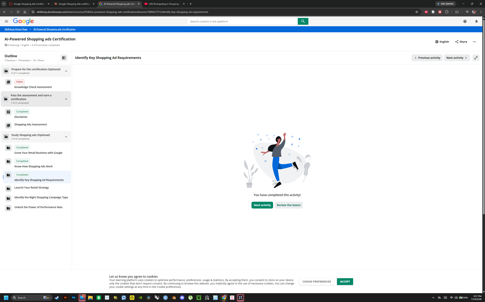

# Overview

This report documents the first part of my individual professional certification work for the CPP Farm Store Omnichannel Consulting Project. It includes proof that I completed the three assigned Google Skillshop study modules, along with a reflection connecting the Shopping Ads concepts from those modules to the CPP Farm Store.

**Assigned Skillshop modules:**

1. Grow Your Retail Business with Google
2. Know How Shopping Ads Work
3. Identify Key Shopping Ad Requirements

# Proof of Module Completion

The screenshot below shows the course outline for the **AI-Powered Shopping Ads Certification** in Google Skillshop. All three assigned study modules are marked **Completed**: **Grow Your Retail Business with Google**, **Know How Shopping Ads Work**, and **Identify Key Shopping Ad Requirements**.

# CPP Farm Store Application Reflection

## How Shopping Ads Could Help CPP Farm Store Reach Customers

The **“Know How Shopping Ads Work”** module emphasized that shoppers need three key pieces of information at the beginning of their journey: a product image, title, and price. Unlike traditional search ads, Shopping ads are created automatically from the product information uploaded to Google Merchant Center rather than from written ad copy. For the CPP Farm Store, this means someone searching for “local honey near me” or “fresh strawberries in Pomona” could see an actual Farm Store product, including its photo and price, before they even know the store exists. In this case, the product data itself becomes part of the marketing.

The module also explained that free product listings on the Shopping tab can expand visibility without requiring additional ad spending, which is especially valuable for a university-affiliated store with a limited budget. It also distinguished between **Product Shopping ads**, which direct customers to a website, and **Local Inventory ads**, which use local inventory information to encourage in-store visits. Together, these options fit the Farm Store’s omnichannel model by supporting online purchases now and potentially increasing campus store traffic in a future phase.

## Customer Segment That Would Benefit Most

The customer segment that would benefit most from stronger online product discovery is the **local community shopper**,Pomona-area residents who value fresh, locally produced goods but may have no connection to Cal Poly Pomona and little reason to discover the Farm Store on their own. Students and faculty are more likely to hear about the store through campus proximity, university communication, or word of mouth. Community shoppers, however, are more likely to begin their search on Google. Product listings could reach them at the beginning of that journey by turning searches for local produce, honey, or plants into awareness of the Farm Store and potentially a first visit.

## Product Information and Ecommerce Requirements to Prepare

The requirements module made it clear that preparation needs to happen at both the product and website level. For each item, the Farm Store needs an accurate title, description, high-quality image, current price, and availability status that match the product’s landing page. Google’s misrepresentation policy requires the information shown in the listing to be consistent with what the customer actually sees and can purchase on the website.

At the website level, Google also checks the quality of the overall shopping experience. The store needs a visible way for customers to make contact, a secure SSL checkout, accessible product pages, a working add-to-cart and checkout process, and a clearly stated return and refund policy. A retailer can choose not to accept returns, but that policy still needs to be clearly communicated before checkout. Shopify already provides SSL security, which gives the Farm Store a strong starting point. However, the store will still need to publish its policies and keep its Shopify inventory synchronized with the product feed. This will be especially important for seasonal and perishable products, where availability can change quickly.

## Risks and Challenges Before Using Shopping Ads

The enforcement module explained that violations can escalate in two stages. Individual products may first be disapproved because of data-quality problems, but if those issues are not corrected by the deadline, the entire Merchant Center account can be suspended. This is one of the biggest risks for the Farm Store. Seasonal produce requires listings to be updated or paused frequently, and a small staff could easily overlook the warning emails Google sends when problems are found. The module’s S-Mart example showed how one ignored product disapproval can eventually turn into an account-level suspension warning.

The Farm Store may also run into identifier or product-category issues with some agricultural products. In addition, launching ads without conversion tracking would mean spending money without learning which products, searches, or campaigns are actually producing results.

## Application to Group Project Deliverables

This work connects directly to our Seis Leches project deliverables. For the **Shopify Mini-Store**, the landing-page requirements give us a clear compliance checklist to review before recommending any advertising spend, including a visible contact method, a published refund policy, and a working checkout process. For the **Product Feed**, our group has already created a Merchant Center feed with eighteen offers and identified several feed-quality issues. Understanding how product disapprovals can escalate into an account suspension helps us determine which problems need to be fixed first.

For the **Retail Media Setup**, the modules support a phased approach. The Farm Store should begin with free product listings, confirm that the feed is healthy through Merchant Center Diagnostics, and only launch paid Shopping campaigns once conversion tracking is working correctly. Local Inventory ads could then be considered in a later phase to help increase in-person traffic to the campus store.

# Appendix

## Published Report

- **GitHub Pages:** [https://jakevns.github.io/RStudio/Google.Shopping.Ads/Evans%2CJake-IBM6300-GoogleShoppingAds1.html](https://jakevns.github.io/RStudio/Google.Shopping.Ads/Evans%2CJake-IBM6300-GoogleShoppingAds1.html)

## Repository

- **GitHub Repo:** [https://github.com/jakevns/RStudio/tree/main/Google.Shopping.Ads](https://github.com/jakevns/RStudio/tree/main/Google.Shopping.Ads)