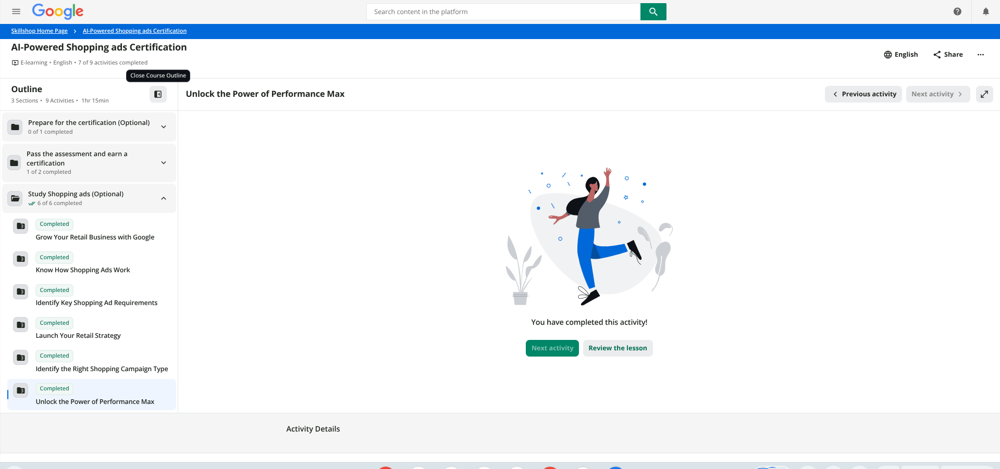

# Overview

This report documents the completion of Part 2 of the Google Shopping Ads Certification, which covered three Google Skillshop study modules:

1. **Launch Your Retail Strategy**
2. **Identify the Right Shopping Campaign Type**
3. **Unlock the Power of Performance Max**

These modules build on Part 1 of the certification, which covered growing a retail business with Google, understanding how Shopping ads work, and identifying key Shopping ad requirements. They also connect directly to the CPP Farm Store group project because our campaign plan will require many of the same decisions, including choosing the right campaign strategy, deciding which products to prioritize, and selecting the most effective channels for reaching customers.

# Proof of Completion

As shown in @fig-completion, all six activities in the **“Study Shopping Ads (Optional)”** section are marked **Completed**. This includes the three modules assigned for Part 2 of the certification: **Launch Your Retail Strategy**, **Identify the Right Shopping Campaign Type**, and **Unlock the Power of Performance Max**.

{#fig-completion}

# Module Summaries

## Launch Your Retail Strategy

This module explains the two platforms that work together behind Shopping ads: **Google Merchant Center**, which stores the product inventory feed and tells Google what is available for sale, and **Google Ads**, which is used to create and manage the campaign that promotes those products. It also introduces optional Merchant Center programs such as **Promotions**, which can display special offers alongside Shopping ads, and **Product Ratings**, which show aggregated customer reviews on a 1–5 star scale. The module also reviews how product feeds work, including required attributes such as `id`, `title`, `description`, `link`, `image_link`, `availability`, `price`, and `gtin`, as well as optional attributes such as `custom_label_0`, `product_type`, `gender`, `age_group`, `color`, and `condition`. A recommended title structure is **brand + product type + key attributes**, which helps customers and Google understand the product more clearly. Finally, the module explains that product feeds can support formats beyond Shopping ads, including Video Action Campaigns.

## Identify the Right Shopping Campaign Type

This module compares **Performance Max for Retail** with **Standard Shopping campaigns** in terms of bidding options, reach, and ad formats. Performance Max supports a wider range of bidding strategies, including Maximize Conversion Value with an optional target ROAS, store visit optimization, new customer acquisition, CPA-based goals, and Maximize Conversions with an optional target CPA. It can also serve ads across Search, Search Partners, YouTube, Gmail, Discover, Display, Maps, and Apps. Standard Shopping offers fewer bidding options, such as target ROAS, enhanced CPC, Maximize Clicks, Maximize Conversions, and Manual CPC, and its reach is mainly limited to the Search Network, Search Partners, and YouTube. The module also introduces **product groups**, which allow advertisers to organize products into smaller inventory segments and adjust bids based on factors such as profitability, popularity, or business priority.

## Unlock the Power of Performance Max

This module explains in more detail how **Performance Max** works. It uses Google AI and machine learning to evaluate search queries, customer intent, seasonality, product data, and website engagement in real time. Based on those signals, it estimates the likelihood and potential value of a conversion, then automatically adjusts bids, selects the most relevant creative assets, and chooses the best Google channel for each auction—all within a fraction of a second. Performance Max can reach customers who are actively searching, people who have already visited the website, new prospective customers, and existing customers who may be ready to purchase again. Before launching, the campaign requires an approved Merchant Center product feed and creative assets that meet Google’s requirements. Existing Smart Shopping or Local campaigns can also be moved to Performance Max either in bulk or individually through the Notifications panel, Recommendations page, or Campaigns page.

# CPP Farm Store Application Reflection

Everything covered in these certification modules connects directly to the decisions our group still needs to finalize for the CPP Farm Store campaign plan, **“Fresh This Week—Grown at Cal Poly Pomona.”**

**Campaign objective.** The best fit for the CPP Farm Store is an **omnichannel sales objective** that gives credit to both online purchases and in-store visits rather than focusing only on online sales or leads. Our GP1 customer journey map identified a gap between online awareness and in-store conversion: students may discover the Farm Store online but do not always follow through with a physical visit. A campaign focused only on online transactions would overlook an important part of the customer journey, so the objective should value both digital purchases and visits to the campus store.

**Product prioritization.** Our GP3 Merchant Center feed already includes 18 offers across six categories: Fresh Produce, CPP Favorites, Specialty Foods, Gift Baskets and Gift Boxes, Student-Friendly Snacks and Drinks, and Seasonal Bundles. For the first campaign, I would prioritize **Fresh Produce and Seasonal Bundles** because they create urgency and can encourage repeat visits. I would also feature **CPP Favorites**, such as CPP Farms Ice Cream, because these products strengthen the store’s unique campus identity and are more difficult for customers to replace with products from another retailer. Gift Baskets could receive a secondary promotional push around move-in, holidays, and graduation, when the **“Proud CPP Gifters”** segment from our journey map is likely to be most active.

**Campaign type.** I would recommend **Performance Max for Retail** rather than Standard Shopping. The Farm Store’s feed is relatively small, with only 18 offers, and our team does not have the time or resources to manage several separate campaign types. A single campaign that automatically optimizes across channels and goals would be more practical than manually managing Standard Shopping’s narrower bidding and inventory options. Performance Max also supports store-visit optimization and Maps placements, which directly address the online-to-in-store conversion gap identified in GP1. For a campus retail location, actions such as requesting directions can be meaningful conversions.

**Channels and touchpoints.** In addition to Search and Shopping placements, Performance Max could help the Farm Store appear across **Maps, Display, Discover, and YouTube**. Maps could help customers find directions to the Kellogg Ranch location, while Display and Discover could retarget people who visited the Shopify prototype but did not complete a purchase. YouTube could support short videos about the farm, student-grown products, or weekly product highlights, connecting directly to the **Farm Story** section developed for the GP2 homepage. The Shopify mini-store would remain the landing destination for paid traffic.

**KPIs.** I would track **store visits or direction requests, click-through rate to the Shopify site, purchase conversion rate, ROAS, average order value, and new customer acquisition rate**. I would also monitor product-feed health, especially item disapprovals, because Performance Max depends on an accurate and approved Merchant Center feed.

**Connection to group deliverables.** This reflection connects directly to the **Channel Strategy** and **KPIs and Measurement** sections of our GP4 Campaign Plan. It also gives the Creative Brief a clearer list of the video, image, and text assets needed for Performance Max and provides our dashboard with specific metrics to track. Most importantly, it ensures that the campaign measures both store visits and online purchases rather than treating online conversions as the only meaningful outcome.

# Appendix

- **GitHub Repository:** [github.com/jakevns/RStudio](https://github.com/jakevns/RStudio/tree/main/Google.Shopping.Ads)
- **GitHub Pages (Published Report):** [jakevns.github.io/RStudio/Google.Shopping.Ads/Evans%2CJake-IBM6300-GoogleShoppingAds2.html](https://jakevns.github.io/RStudio/Google.Shopping.Ads/Evans%2CJake-IBM6300-GoogleShoppingAds2.html)
