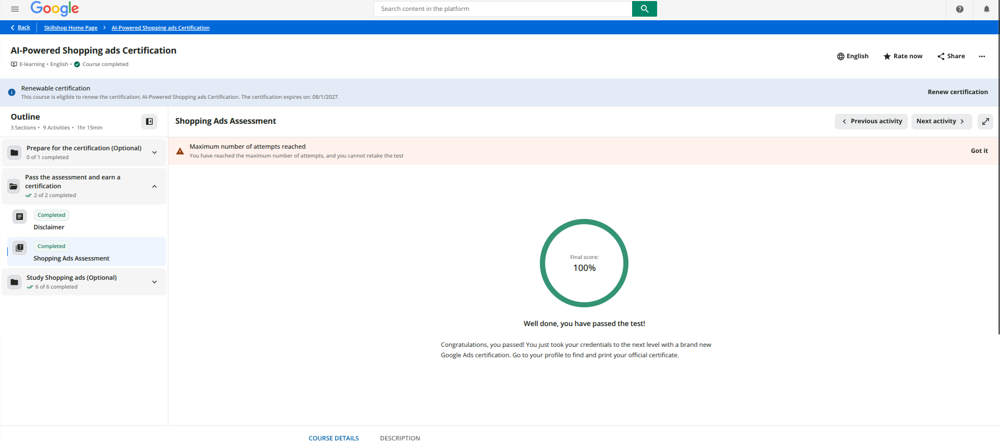

## Purpose

The final step in IBM 6300’s individual professional certification series was completing the Google Shopping Ads Certification assessment through Google Skillshop. This report provides proof of completion and reflects on how the certification relates to the CPP Farm Store group project and contributes to my professional development.

## Proof of Certification Completion

The certification is currently listed in Google Skillshop as the **AI-Powered Shopping Ads Certification**, the updated version of the Google Shopping Ads Certification. I passed the assessment with a score of 100%, and the renewable certification remains valid through August 1, 2027.

## Final Application Summary

### Three most useful concepts learned

Three concepts from the certification stood out as especially useful for my work this term. The first was the importance of the **product feed** in Google Merchant Center. Details such as GTIN, product category, availability, and price directly affect whether a product is eligible to appear, so feed quality can have a major impact on Shopping ad performance. The second was the growing role of **Performance Max campaigns**, which combine Shopping, Search, Display, and YouTube inventory within a single automated campaign powered by machine learning and asset groups. The third was the expansion of **retail media** as its own discipline, including how retailers use their digital shelf space and first-party data to create advertising opportunities that differ from, but increasingly overlap with, traditional Google Shopping campaigns.

### Connecting the certification to CPP Farm Store's omnichannel opportunities

CPP Farm Store already has a strong in-person identity because it sells fresh produce grown on campus, but the online side still needs to feel just as trustworthy. The certification helped me understand how important that connection is. When our group built the Google Merchant Center feed with 18 offers across 6 categories, every product needed accurate and consistent information. If details such as price, availability, or product category were missing or incorrect, the listings might not show at all, no matter how good the campaign idea was. I also learned that Performance Max could be useful for a small retailer like CPP Farm Store because it uses automation to reach customers across several Google channels without requiring a separate campaign for each one.

### Personal application to the group project

I used what I learned while building the GP3 Google Merchant Center feed for CPP Farm Store. Our group created 18 product offers, and I made sure each one had the required information so the listings would actually be eligible to appear. That same attention to detail carried into the GP4 campaign plan and GP5 creative brief. For our *“Fresh This Week—Grown at Cal Poly Pomona”* concept to work, the product photos and descriptions needed to make sense both in a paid Shopping ad and on the online storefront itself.

### Where I feel more confident professionally

I feel most confident talking about **product feed strategy and Performance Max campaign structure**. I now understand how the quality of the information in a product feed can directly affect whether ads are eligible to run and how well they perform. Since I applied these concepts while working on the CPP Farm Store project, I would also feel comfortable discussing them in an interview instead of only explaining what I learned from the certification.

### Resume / LinkedIn description

On my resume or LinkedIn, I would list it as: *“Google Shopping Ads (AI-Powered Shopping Ads) Certified through Google Skillshop; applied product feed management and Performance Max strategy while building a Google Merchant Center feed for a retail client project.”* Including the project experience shows that I did more than pass the assessment—I also used what I learned to create a real deliverable.

## Appendix

- **GitHub Pages:** [https://jakevns.github.io/RStudio/Google.Shopping.Ads/Evans%2CJake-IBM6300-GoogleShoppingAdsPart3.html](https://jakevns.github.io/RStudio/Google.Shopping.Ads/Evans%2CJake-IBM6300-GoogleShoppingAdsPart3.html)
- **GitHub Repository:** [https://github.com/jakevns/RStudio/tree/main/Google.Shopping.Ads](https://github.com/jakevns/RStudio/tree/main/Google.Shopping.Ads)