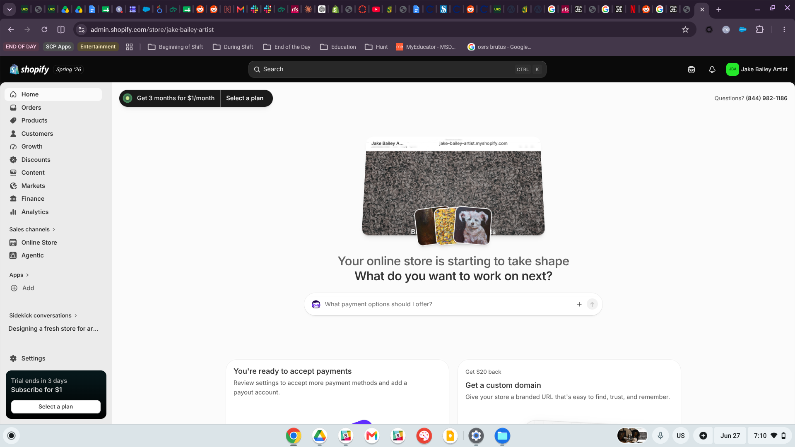
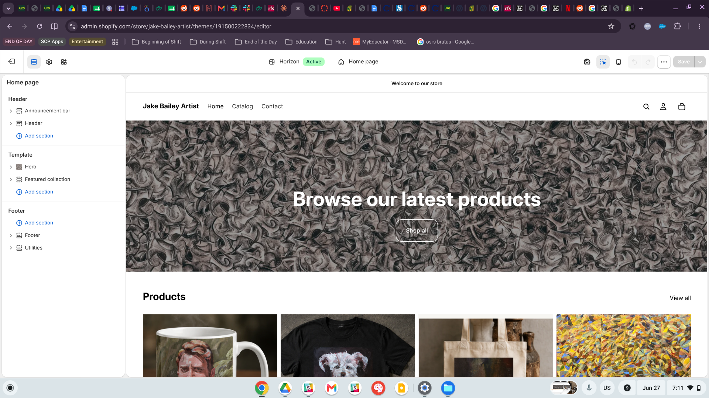
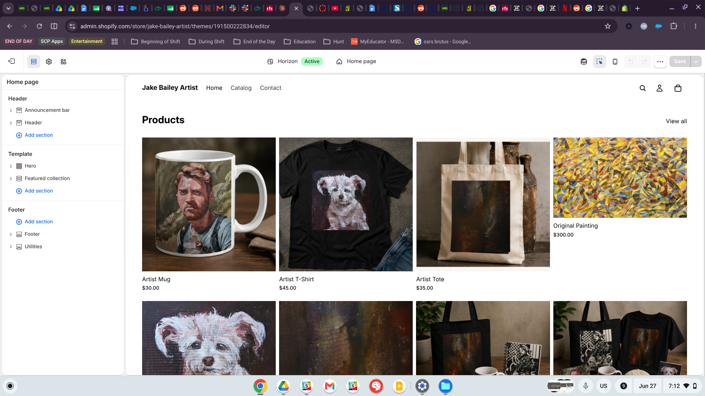
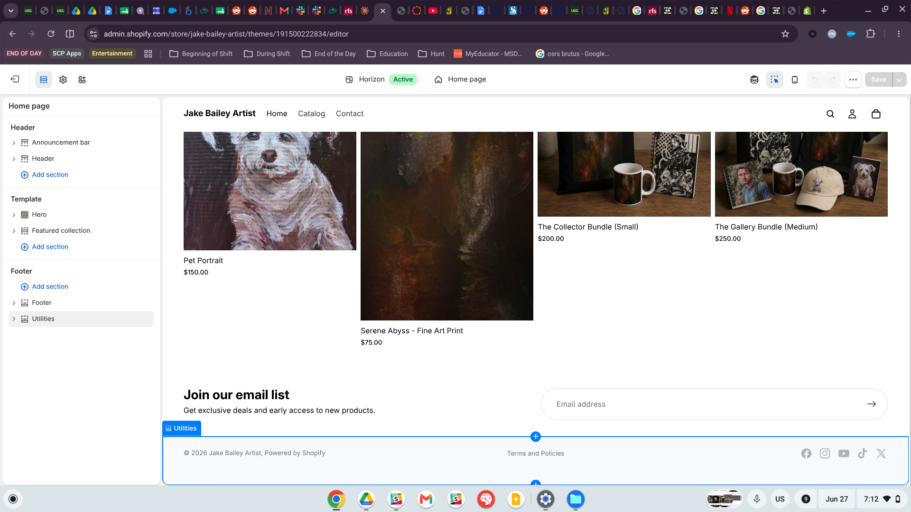
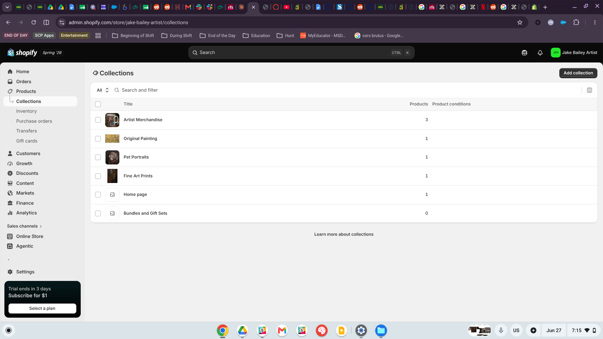
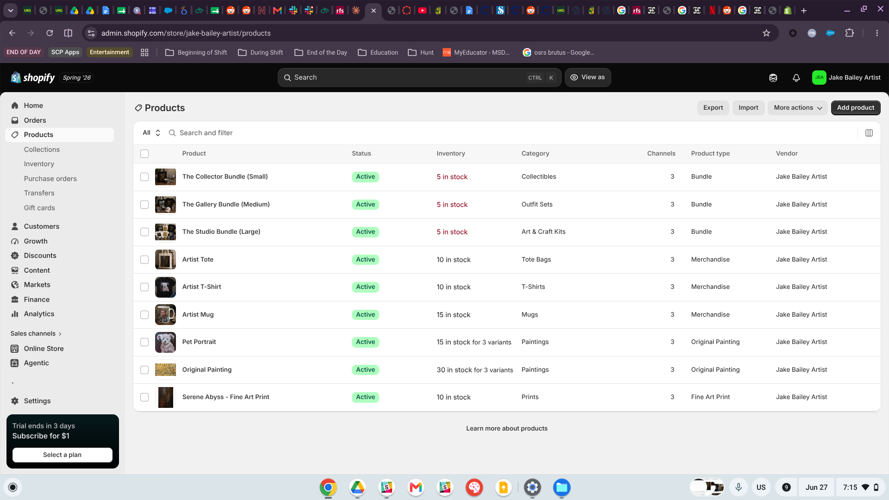

## Store Name and Concept

::: callout-note
## Store Identity

**Jake Bailey Artist** · [jake-bailey-artist.myshopify.com](https://jake-bailey-artist.myshopify.com)

**Password**: IBM6300
:::

The **Jake Bailey Artist** store is a direct-to-consumer online shop inspired by [jakebaileyartist.com](https://jakebaileyartist.com). The online shop features museum quality fine art prints, original paintingsm custum pet portaites, and artist based merchandise (all grounded in Jake Bailey's expressive and painterly style) across acrylic, oil, pastel, graphite, and mixed media.

The storefront is built around a clear brand: this is artwork created by a real artist and isn't pulled randomly from google iamges. The products range from several price points, at its cheapest someone can purhcase a 30 dollar mug or commission a large painting for 700 dollars; making the store approachable for casual buyers while maintaining the value and prestige of the artwork. Overall, the shop is designed to feel more person, intimate, and a collector focused store rather than purely transactional.

> *"Art made by hand, sold with intention."*

------------------------------------------------------------------------

## Target Customer

::: callout-tip
## Customer Profile at a Glance

**Age:** 35–65 · **Values:** Authenticity, handcraft, emotional resonance · **Budget:** \$30–\$700
:::

The primary customer for the **Jake Bailey Artist** store is an art appreciating adult shopper values home decor with personal meaning as opposed to mass produced alternatives. This customer is likely:

- A **homeowner or renter** decorating their space with intention and a clear personal aesthetic.
- A **pet owner** interested in customer or animal themed artwork; especially painted portraiture.
- An **independent artist supporter** who discovers new work organically, through Instagram, Etsy, or art fairs and values the story behind the artwork.
- A **gift buyer** looking for a meaningful, one of a kind present of milestone occasions; birthdays, housewarming, pet adopting.

This customer is comfortable with buying art online, responds well to behind the scenes content and process videos. They are willing to invest in something that feels more personal and will last longer. They're not just comparison shopping for the lowest priced deal, they are buying into Jake Bailey's vision, style, and the story behind the art.

------------------------------------------------------------------------

## Product Category Plan

The store is built around five main product categories. Together, these categories create a clear pricing ladder, allowing customers to enter at both lower price points with merchandise or prints while simoultaneously offering high value original alternatives that are custom commissions.

| \#  | Collection              | Example Products                   | Price Range |
|------------------|------------------|------------------|------------------|
| 1   | **Fine Art Prints**     | Serene Abyss – Fine Art Print      | \$75        |
| 2   | **Original Paintings**  | Original Painting (S/M/L)          | \$300–\$700 |
| 3   | **Pet Portraits**       | Custom Pet Portrait Commission     | \$150–\$350 |
| 4   | **Artist Merchandise**  | Artist Mug, T-Shirt, Tote Bag      | \$30–\$45   |
| 5   | **Bundles & Gift Sets** | Collector, Gallery, Studio Bundles | \$200–\$450 |

: Product Category Plan

::: callout-important
## Tiered Pricing Strategy

The product mix is designed to meet customers at various levels of interest and commitment. There are lower priced items, such as mugs or tote bags, to give new buys an easier way to support the artist or purchase a gift for a loved one. Mid tier options are also available, such as prints or bundles, to appears to customers who are looking for home decor. And finally, the high priced commissions and original paints preserve the exclusivity and value of the Jake Baileys original artwork.
:::

------------------------------------------------------------------------

## Initial Shopify Setup Evidence

::: panel-tabset
### Admin Dashboard

The Shopify Admin area serves as the main control center for the store, where products, orders, customers, analytics, and the store front design can be managed in one place. The screenshot shows the home dashboard after the initial store setup, including a live preview of the **Jake Bailey Artist** storefront with real product offerings added.

{fig-alt="Shopify admin home screen showing store preview with Jake Bailey Artist branding" width="100%"}

### Selected Theme

The store utilizes the **Horizon Theme** (Version 4.1.1), which was selected for the bold editorial layout, full width hero image support (to help Jake Bailey's artwork jump out at the viewer), and a clean product grid. The minimal, gallery focused design works in sync with a fine art store page since it allows the artwork to remain the visual focal point of the shopping experience.

{fig-alt="Shopify themes page showing Horizon as the active theme" width="100%"}

### Homepage — Hero Section

The homepage opens with a dramatic hero image featuring one of Jake Bailey's digital prints, immediately establishing the stores artistic identity, before the customer has even had a chance to view a price point. Below the hero image, the "Browse our latest products" heading and "Shop all" call-to-action gracefully guide the user, utilizing the Horizon theme layout to its potential. The left panel shows the homepage section structure, which is used to organize and compose the storefront.

{fig-alt="Shopify theme editor showing homepage hero with graphite painting as banner image" width="100%"}

### Homepage — Products Grid

Scrolling below the hero image, the featured products grid highlights a mix of items; including an **Artist Mug** (\$30), **Artist T-Shirt** (\$45), **Artist Tote** (\$35), and **Original Painting** (\$300). This diverse selection intentionally combines acessible merchandise with higher value fine art; providing customers a quick sense of the stores full product assortment.

{fig-alt="Shopify theme editor products section showing four featured products" width="100%"}

### Homepage — Lower Section & Footer

The lower section of the homepage continues the product showcase with the **Pet Portrait Commission** (\$150), **Serene Abyss Fine Art Print** (\$75), and bundle offerings, including **The Collector Bundle** (Small, \$200) and **The Gallery Bundle** (Medium, \$250). The footer rounds out the page with an email list signup and social media links, providing the visitors clear ways to stay connected with Jake Bailey beyond the shopify storefront.

{fig-alt="Shopify theme editor lower homepage showing pet portrait, Serene Abyss print, bundle products and footer" width="100%"}

### Collections

The store is organized into five collections that align with the overall product category plan: **Artist Merchandise** (3 products), **Original Painting** (1 product), **Pet Portraits** (1 product), **Fine Art Prints** (1 product), and **Bundles and Gift Sets**. This collection structure makes the store easier to navigate because customers can shop based on what they are looking for, whether that is a gift, a custom commission, a fine art print, or an original work.

{fig-alt="Shopify collections admin page showing five collections" width="100%"}

### Products

The full product catalog includes nine active listings across all store categories: **The Collector Bundle** (Small), **The Gallery Bundle** (Medium), **The Studio Bundle** (Large), **Artist Tote**, **Artist T-Shirt**, **Artist Mug**, **Pet Portrait**, **Original Painting**, and **Serene Abyss – Fine Art Print**. Each product is marked as active and assigned to the appropriate collection, keeping the catalog organized and ready for customers to browse efficiently!

{fig-alt="Shopify products admin page showing all nine active product listings" width="100%"}
:::

------------------------------------------------------------------------

## Connection to CPP Farm Store

The **Jake Bailey Artist** store and the **CPP Farm Store** consulting project both connect to the same core retail challenge: *how can a niche, identity based Brand communicate their values to the correct client?* In the Farm Store project, our group's perceptual analysis showed that the CPP Farm Store occupies a lower price, with a highly unique position by leaning into their Cal Poly agricultural based heritage and campus rooted mission. Similarly, Jake Bailey Artist's store differentiates itself through unique authorship, an individual artistic identity, and original creative works as opposed to competign with mass market art retailers such as Society6 or Redbubble.

Building this Shopify store required many similiar strategic decisions we are applying to the Farm Store Project. The setup process forced me to carefully consider who our customer is, what they value, which product categories support the brand, and how the store front can communicate its identity within the first couple seconds of visiting. Elements like the hero image, navigation labels, clean collection structure, and freatured products sections all help signal what sort of store this is before the customer has to click a product.

For example, leading the homepage with a dramatic Digital Print instead of a standard product shot is brand based choice. It introduces the store through the visual identity of Jake Bailey rather than focusign on price or product specs. That is similar to the way the CPP Farm Store leads with its agricultural based mission and campus connect; rather than just focusing solely on price.

Working through the Shopify setup made the retail strategy behind our consulting project feel much more concrete. No longer are these abstract frame works from class but instead have become real decisions businesses make when shaping a brands identity, organizing products, and guiding customers through the shopping experience.

------------------------------------------------------------------------

## Appendix {.unnumbered}

::: callout-note
## Project Links

- **GitHub Repository:** <https://github.com/jakevns/RStudio>
- **GitHub Pages (Live Report):** [https://jakevns.github.io/RStudio/](https://jakevns.github.io/RStudio/ITP-W04-Shopify-store-Assignment-2/Evans,Jake-ITP-Assign2.html){.uri}
- **Shopify Store (password:** yeewhi) **:** <https://jake-bailey-artist.myshopify.com>
:::
