## Introduction

This report goes over the product catalog I created for my Shopify practice store, **Jake Bailey Artist**[^1]. The store builds on my professional art brand by turning it into an e-commerce shop with original paintings, commissioned pet portraits, fine art prints, and art-printed merchandise. I added **nine total products** to the store, with a range of price points so different types of customers have options. Someone could start with a \$30 mug, while a more serious collector could purchase a \$700 large-format original painting.

[^1]: The store is built on a Shopify development plan for educational purposes. The storefront is available at <https://jake-bailey-artist.myshopify.com>.

::: callout-note
## About the Screenshots

All of the evidence in this report comes from the Shopify **product admin pages**. These pages show the full product record in one place, including the title, description, media, pricing, inventory tracking, product type, vendor, collections, tags, and category metafields. Since some of the products have more information than can fit on one screen, I documented most of them with two or three screenshots to make sure the full product page is covered.

:::

## Product List

The table below (@tbl-products) summarizes all nine products in the catalog. The full evidence for each product follows in @sec-evidence.

```{r}
#| label: tbl-products
#| tbl-cap: "Product catalog summary — Jake Bailey Artist Shopify store"

products <- data.frame(
  Product = c("The Collector Bundle (Small)",
              "The Gallery Bundle (Medium)",
              "The Studio Bundle (Large)",
              "Artist Tote",
              "Artist T-Shirt",
              "Artist Mug",
              "Pet Portrait",
              "Original Painting",
              "Serene Abyss - Fine Art Print"),
  Type = c("Bundle", "Bundle", "Bundle",
           "Merchandise", "Merchandise", "Merchandise",
           "Original Painting", "Original Painting", "Fine Art Print"),
  Category = c("Collectibles", "Outfit Sets", "Art & Craft Kits",
               "Tote Bags", "T-Shirts", "Mugs",
               "Paintings", "Paintings", "Prints"),
  Price = c("$200.00", "$250.00", "$300.00",
            "$35.00", "$45.00", "$30.00",
            "$150 - $350 (3 sizes)", "$300 - $700 (3 sizes)", "$75.00"),
  Inventory = c("5 in stock", "5 in stock", "5 in stock",
                "10 in stock", "10 in stock", "15 in stock",
                "15 in stock (3 variants)", "30 in stock (3 variants)",
                "10 in stock"),
  Vendor = rep("Jake Bailey Artist", 9)
)

knitr::kable(products)
```

## Product Catalog Evidence {#sec-evidence}

The screenshot in @fig-products-list shows the complete Products page in Shopify admin, confirming all nine products are **Active**, inventory-tracked, categorized, typed, and assigned to the Jake Bailey Artist vendor.

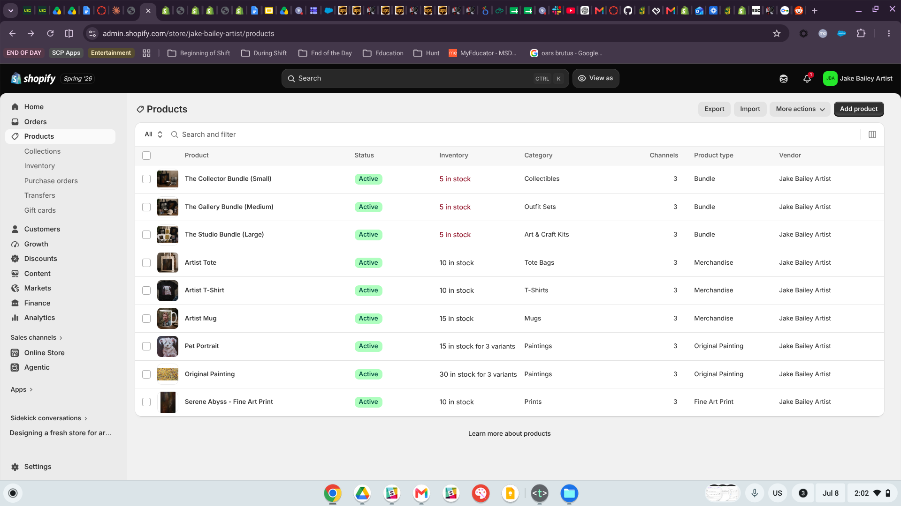{#fig-products-list}

### Bundles and Gift Sets

The three bundles follow a **good-better-best** structure: each step up adds another merchandise item, and the naming (Small / Medium / Large) makes the ladder easy for customers to understand at a glance.

#### The Collector Bundle (Small) --- \$200.00

::: panel-tabset
## Product Details {.unnumbered}

@fig-collector-1 shows the title, customer-facing description, product image, Bundle product type, Jake Bailey Artist vendor, Bundles and Gift Sets collection, and tags.

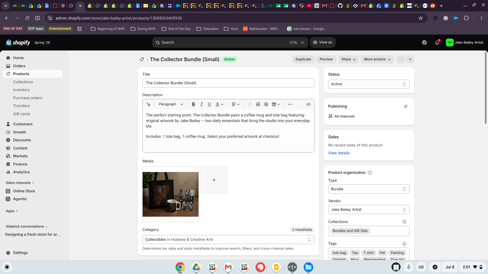{#fig-collector-1}

## Pricing & Inventory {.unnumbered}

@fig-collector-2 shows the \$200.00 price, tax settings, and tracked inventory of 5 units on hand.

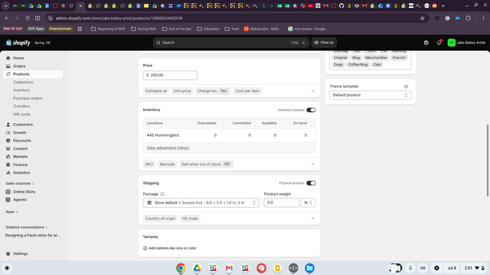{#fig-collector-2}
:::

#### The Gallery Bundle (Medium) --- \$250.00

::: panel-tabset
## Product Details {.unnumbered}

@fig-gallery-1 shows the title, description, bundle photography, Bundle type, vendor, collection, and tags.

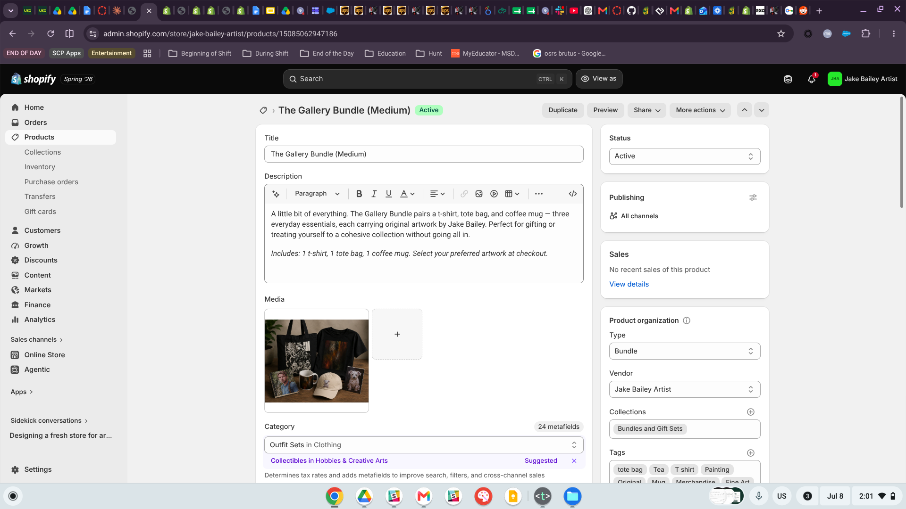{#fig-gallery-1}

## Pricing & Inventory {.unnumbered}

@fig-gallery-2 shows the \$250.00 price and tracked inventory of 5 units.

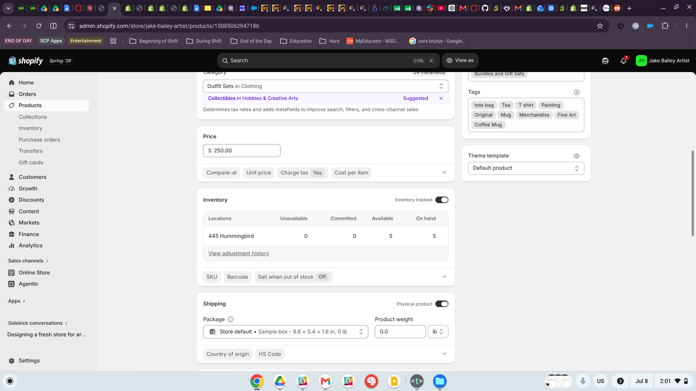{#fig-gallery-2}
:::

#### The Studio Bundle (Large) --- \$300.00

::: panel-tabset
## Product Details {.unnumbered}

@fig-studio-1 shows the title, description, full-collection photography, and Bundle type. The description leans into the gifting occasion: "The ultimate gift. The ultimate flex."

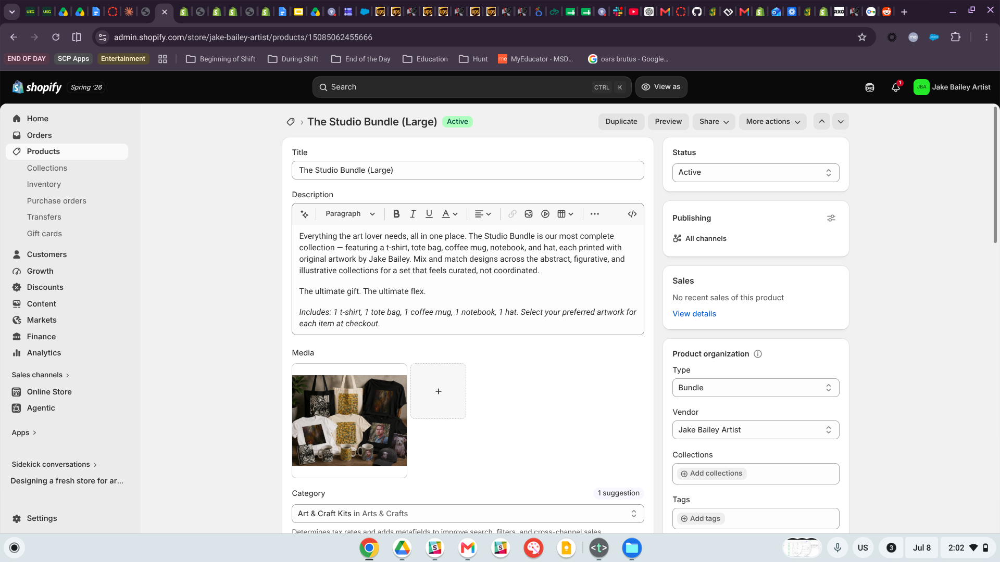{#fig-studio-1}

## Pricing & Inventory {.unnumbered}

@fig-studio-2 shows the \$300.00 price, tracked inventory of 5 units, and the tag set covering every item in the bundle.

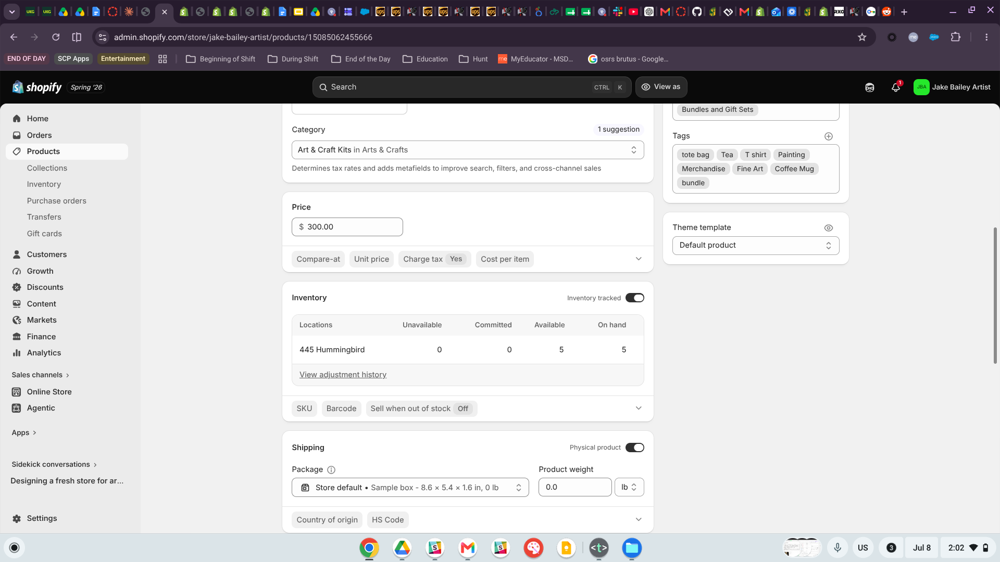{#fig-studio-2}
:::

### Artist Merchandise

The merchandise line offers low-cost entry points into the brand. Each item is printed with original artwork, so even a \$30 purchase carries the studio identity.

#### Artist Tote --- \$35.00

::: panel-tabset
## Product Details {.unnumbered}

@fig-tote-1 shows the title, description, five product photos showing different artwork options, Merchandise type, Artist Merchandise collection, and tote bag tag.

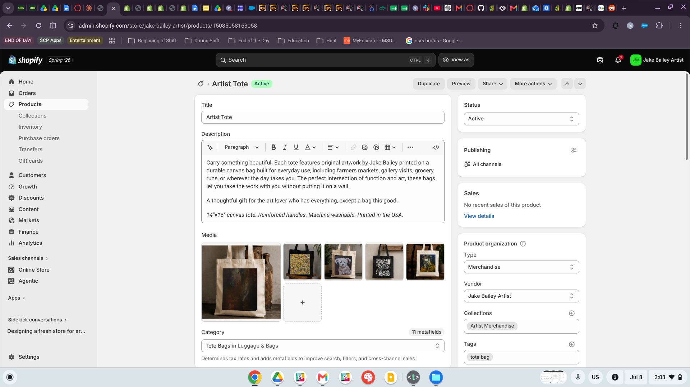{#fig-tote-1}

## Pricing & Inventory {.unnumbered}

@fig-tote-2 shows the \$35.00 price and tracked inventory of 10 units.

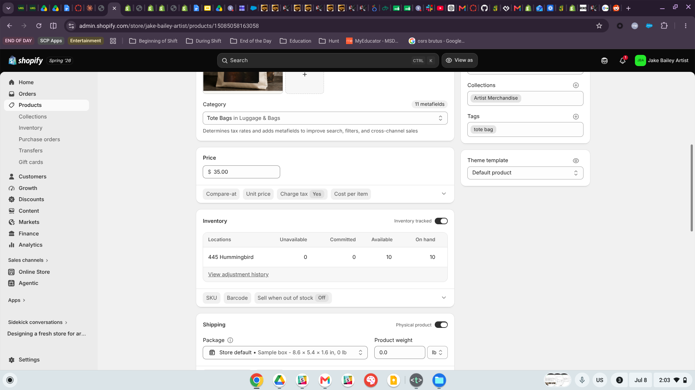{#fig-tote-2}
:::

#### Artist T-Shirt --- \$45.00

::: panel-tabset
## Product Details {.unnumbered}

@fig-tshirt-1 shows the title, description, product photography, Merchandise type, and T-Shirts category.

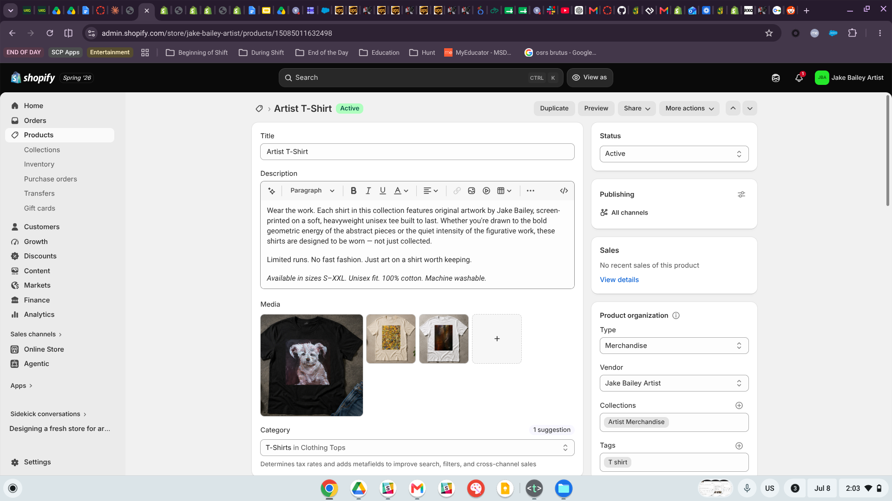{#fig-tshirt-1}

## Pricing & Inventory {.unnumbered}

@fig-tshirt-2 shows the \$45.00 price and tracked inventory of 10 units.

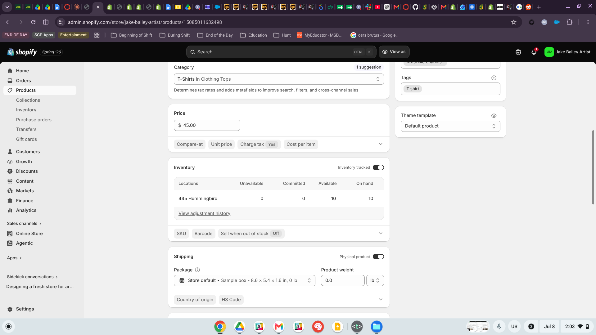{#fig-tshirt-2}
:::

#### Artist Mug --- \$30.00

::: panel-tabset
## Product Details {.unnumbered}

@fig-mug-1 shows the title, description, five product photos, Merchandise type, and Mugs category.

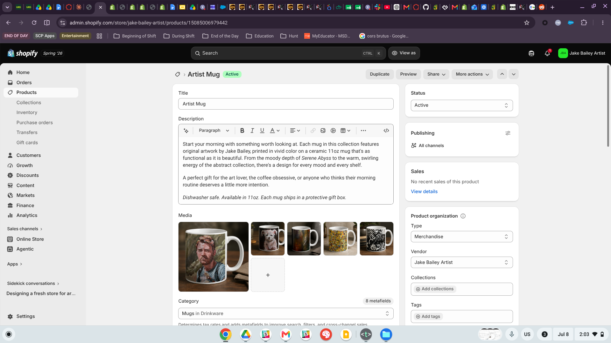{#fig-mug-1}

## Pricing & Inventory {.unnumbered}

@fig-mug-2 shows the \$30.00 price, tracked inventory of 15 units, Artist Merchandise collection, and tags.

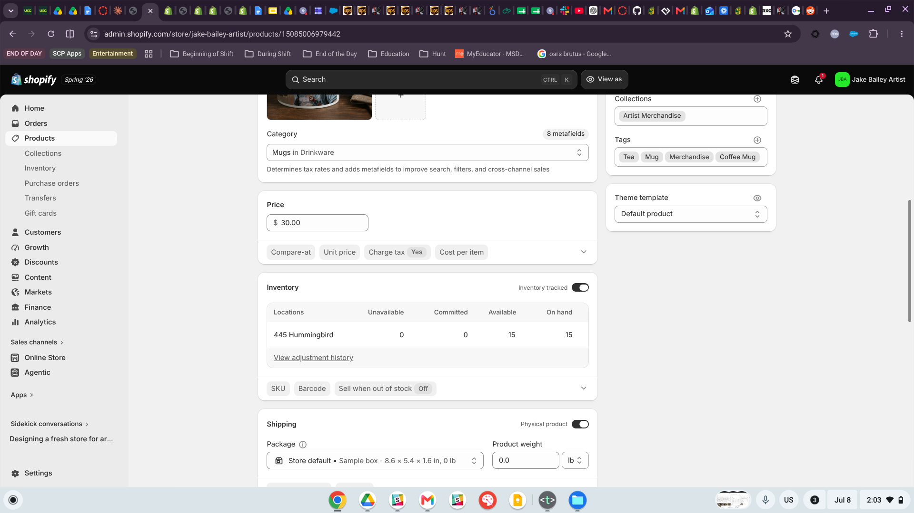{#fig-mug-2}
:::

### Original Art and Prints

This tier anchors the store: one-of-a-kind paintings, custom commissions, and an accessible fine art print. Both painting products use **size variants** with tiered pricing.

#### Pet Portrait --- \$150.00 to \$350.00

::: panel-tabset
## Product Details {.unnumbered}

@fig-pet-1 shows the title, description, sample portrait photography, Original Painting type, Pet Portraits collection, and tags (Pet, Painting, Original, Fine Art, Dogs, Cats).

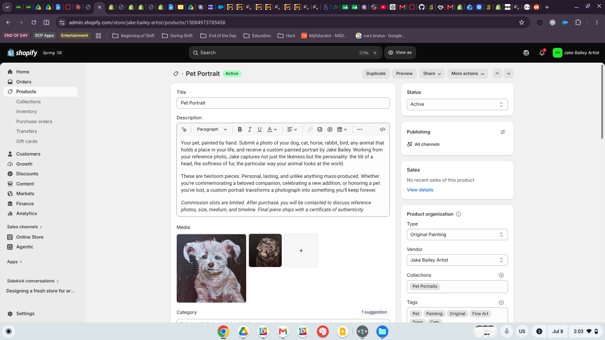{#fig-pet-1}

## Variants & Pricing {.unnumbered}

@fig-pet-2 shows the three size variants — Small (\$150), Medium (\$250), and Large (\$350) — each with 5 units available, for 15 total tracked units.

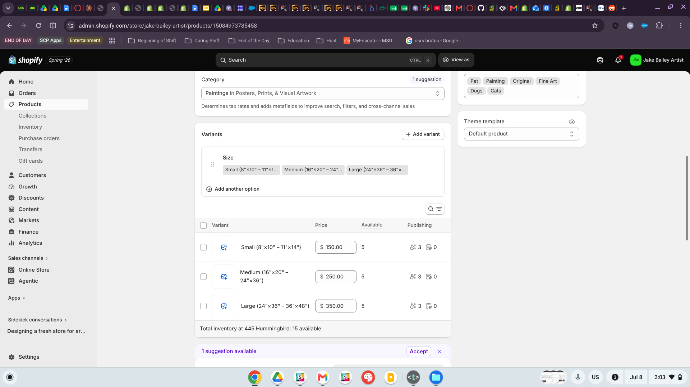{#fig-pet-2}

## Category Metafields {.unnumbered}

@fig-pet-3 shows the completed category metafields, including material (Canvas), art movement, painting medium (Oil), rarity, and theme.

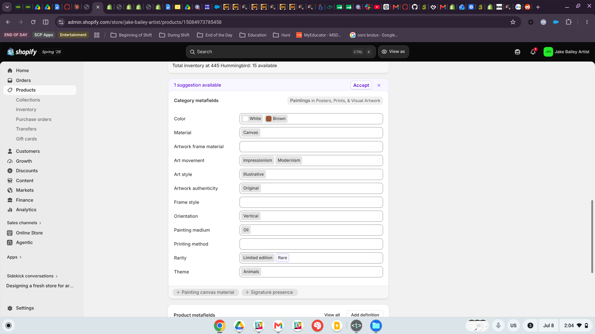{#fig-pet-3}
:::

#### Original Painting --- \$300.00 to \$700.00

::: panel-tabset
## Product Details {.unnumbered}

@fig-original-1 shows the title, description, artwork photography, Original Painting type, Original Painting collection, and tags.

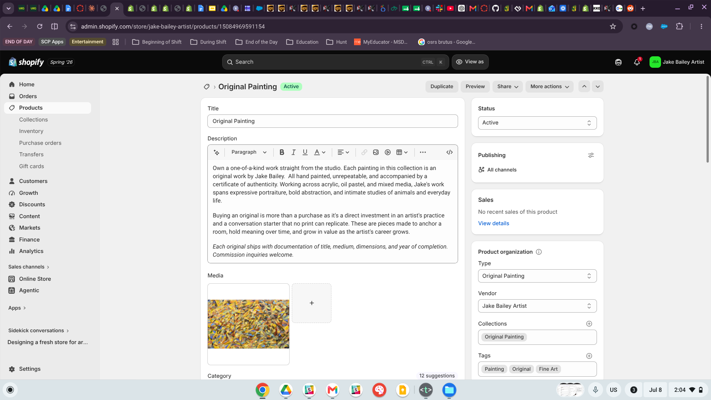{#fig-original-1}

## Variants & Pricing {.unnumbered}

@fig-original-2 shows the three size variants — Small (\$300), Medium (\$500), and Large (\$700) — each with 10 units available, for 30 total tracked units.

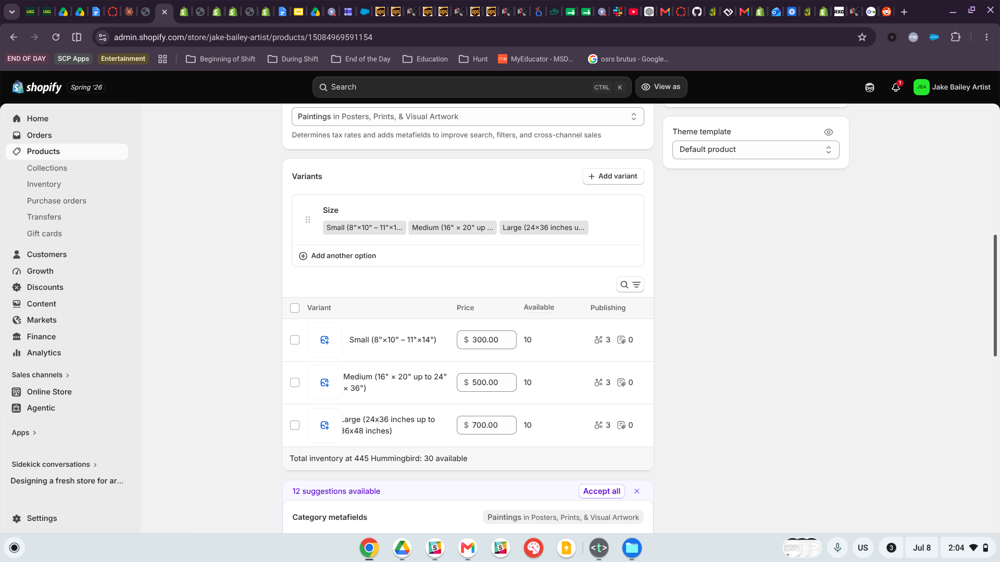{#fig-original-2}

## Category Metafields {.unnumbered}

@fig-original-3 shows the completed category metafields, including materials, painting media (Acrylic, Pastel, Mixed media), rarity, and theme.

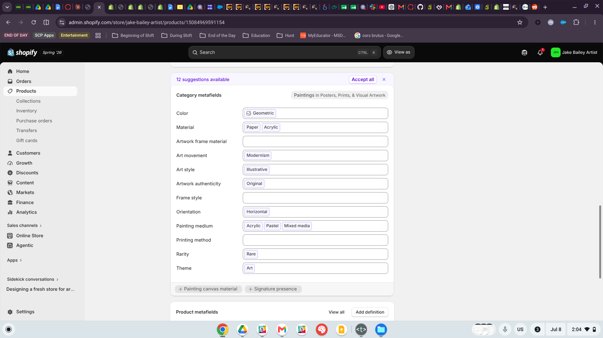{#fig-original-3}
:::

#### Serene Abyss - Fine Art Print --- \$75.00

::: panel-tabset
## Product Details {.unnumbered}

@fig-serene-1 shows the title, description with a formatted "Print Details" list, Fine Art Print type, and the Fine Art Prints and Home page collections.

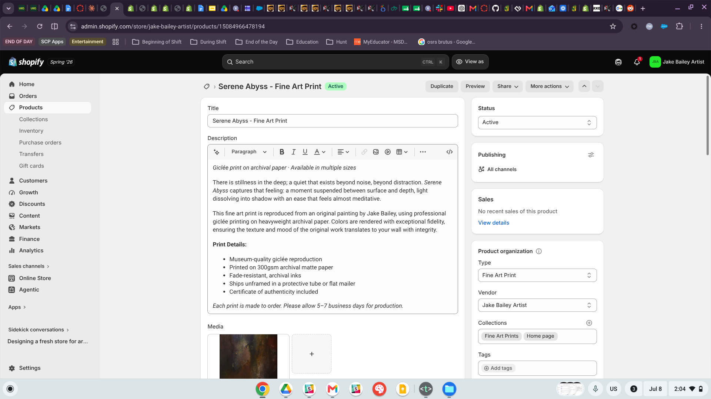{#fig-serene-1}

## Pricing & Inventory {.unnumbered}

@fig-serene-2 shows the \$75.00 price, Prints category, and tracked inventory of 10 units.

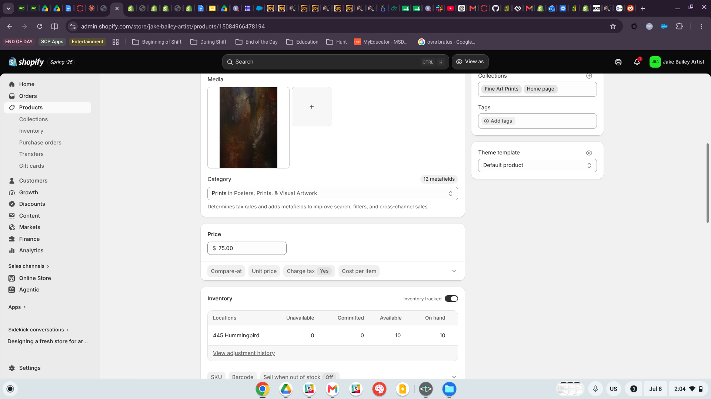{#fig-serene-2}

## Category Metafields {.unnumbered}

@fig-serene-3 shows the completed print metafields, including material (Paper), artwork authenticity (Reproduction), frame style (Unframed), and theme (Nature).

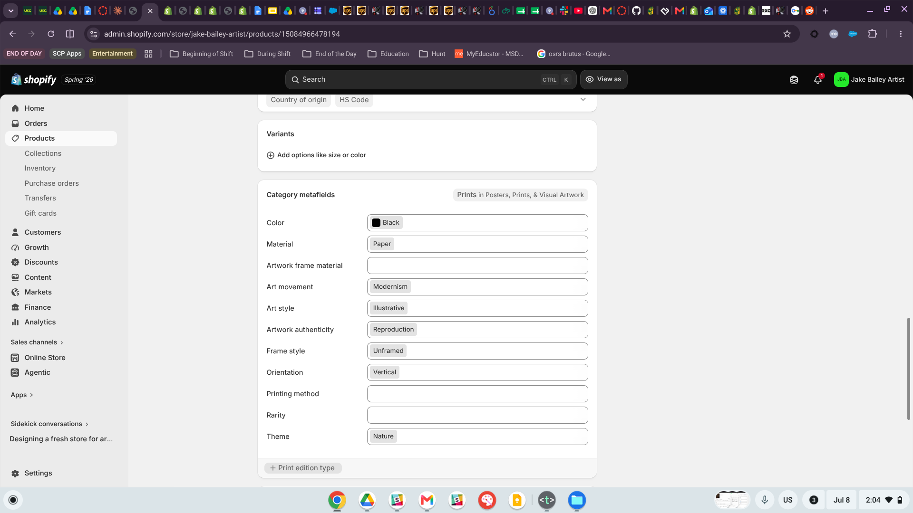{#fig-serene-3}
:::

## Product Description Quality

Every description in the catalog follows the same structure: it explains **what the product is**, then **why a customer would want it**, and closes with the practical details (sizes, materials, care, or fulfillment) in italics. Two examples illustrate the customer-oriented voice used throughout the store.

From the Artist Tote:

> Carry something beautiful. Each tote features original artwork by Jake Bailey printed on a durable canvas bag built for everyday use, including farmers markets, gallery visits, grocery runs, or wherever the day takes you. The perfect intersection of function and art, these bags let you take the work with you without putting it on a wall.

From the Pet Portrait:

> Your pet, painted by hand. Submit a photo of your dog, cat, horse, rabbit, bird, any animal that holds a place in your life, and receive a custom painted portrait by Jake Bailey. Working from your reference photo, Jake captures not just the likeness but the personality: the tilt of a head, the softness of fur, the particular way your animal looks at the world.

::: callout-tip
## Why This Voice Works

Descriptions that connect to the customer’s real life, like “grocery runs” or “a pet you’ve lost,” are more persuasive than descriptions that only list product specifications. The specs are still included, but they come at the end instead of the beginning. That matches the way a good salesperson would talk to a customer: lead with the reason the product matters, then follow with the details.

:::

## Assortment Strategy Reflection

The assortment is built like a **price-tiered ladder around one main brand promise: every product features original artwork by Jake Bailey.** At the entry level, products like the $30 mug, $35 tote, and $45 t-shirt give new customers an easy way to connect with the brand without spending too much. These lower-priced items work well as gifts, impulse purchases, or everyday items that bring the artwork into someone’s daily life.

The middle tier serves customers who want something more elevated but are not necessarily ready to buy an original painting. The $75 fine art print gives customers wall art at a more accessible price, while the three bundles, priced from $200 to $300, turn the merchandise into curated gift sets. These bundles help raise the average order value while also making gift-buying easier.

At the top of the assortment are the commissioned Pet Portraits and Original Paintings, which range from $150 to $700. These are the premium products because they are one-of-a-kind, personal, and emotionally meaningful. They also define what the brand is really about.

The tiers support each other. Merchandise helps spread the artwork and make the brand more accessible. Prints help turn casual fans into collectors. Originals give meaning to the lower-priced items because a $30 mug printed with a real painting feels different from a $30 mug with generic stock art. Overall, the target customer is basically the same person at different levels of commitment: someone who connects with the artwork and can choose how deeply they want to invest in it.


## CPP Farm Store Application Reflection

For CPP Farm Store, the biggest takeaway from this exercise is that **an online catalog has to explain the product the same way staff, signage, and the in-store experience would normally do in person.** Each product needs complete information, including a clear title, honest photos, price, and live inventory. Online shoppers cannot pick up a jar of Bronco Gold honey or ask a student employee questions, so missing details can easily become reasons not to buy.

The product descriptions should also focus on the customer, not just the item itself. Instead of only listing specifications, the description should lead with why the product matters, such as being student-grown, made on campus, or supporting the agriculture program. That story is one of the Farm Store’s strongest advantages compared to a regular grocery store.

Consistent categories, product types, and tags also matter a lot online because they help power search, filters, and collections. A customer searching for “gifts” or “pantry” should see a useful, organized group of products instead of one long flat list.

The Farm Store could also use the same tiered assortment strategy. Everyday staples like produce, meat, and honey can serve as the lower-commitment entry point, while curated gift bundles with campus-made products can create a higher-value option for holidays, alumni, and Bronco families. That feels like a natural fit because the Farm Store’s products are already connected to the university in a more emotional way than ordinary grocery products.


## Appendix {.unnumbered}

- **Published report (GitHub Pages):** <https://jakevns.github.io/RStudio/M05/Evans%2CJake-ITP-Assign3.html>
- **GitHub repository folder:** <https://github.com/jakevns/RStudio/tree/main/M05>
- **Shopify practice store:** <https://jake-bailey-artist.myshopify.com>
