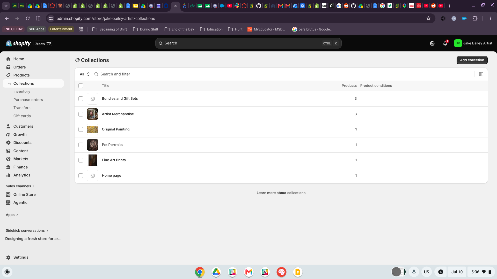
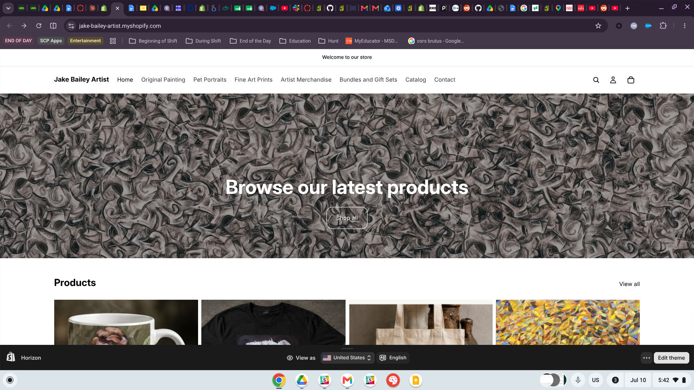
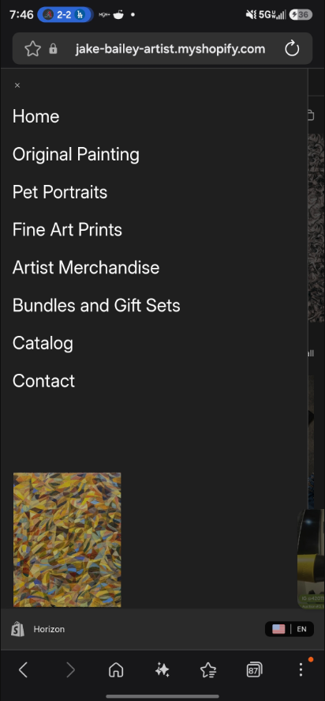
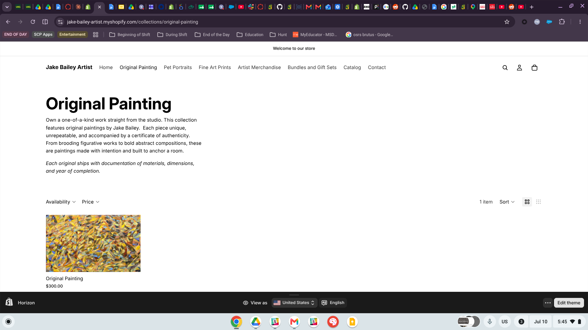
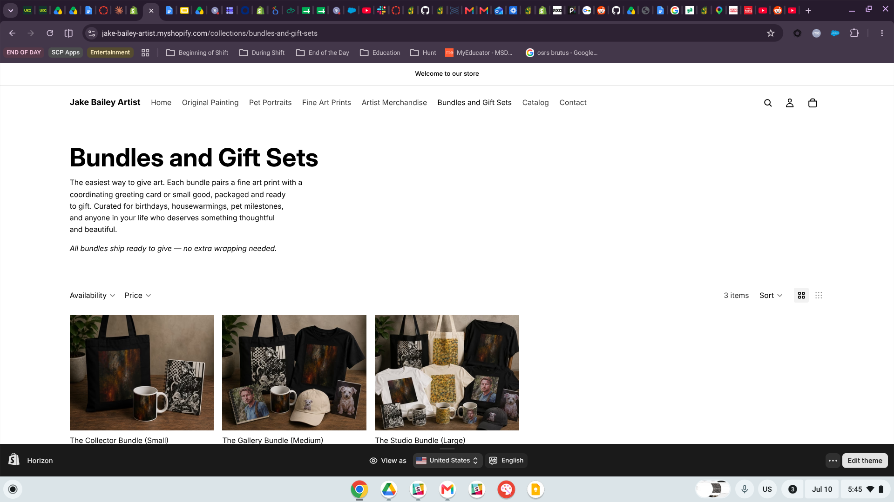
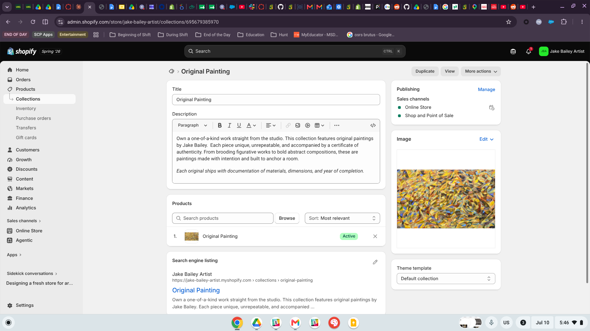
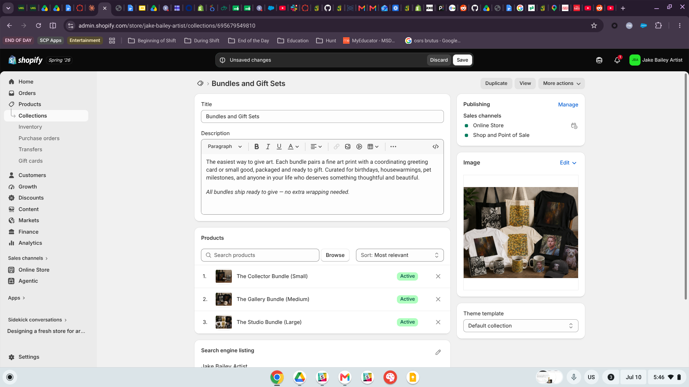

# Introduction

This report explains how I organized the collections and navigation for my Shopify store, **Jake Bailey Artist**[^1], as part of the IBM 6300 individual Shopify store project. The goal of this assignment was to make the store easier for customers to browse. I wanted the product assortment to be clear at a glance, so customers could quickly understand what the store offers and move from discovering a product to purchasing it with as little friction as possible.

[^1]: Storefront: <https://jake-bailey-artist.myshopify.com/>

> "A store's navigation is its floor plan. If customers can't find the aisle, they can't find the product."

::: callout-note
## Store Concept

Jake Bailey Artist is a direct-to-consumer art brand that sells original paintings, fine art prints, commissioned pet portraits, artist merchandise, and curated gift bundles. Since the store includes both lower-priced items and one-of-a-kind original artwork, the assortment has a wide price range. That range shaped how I organized the store’s collections and navigation throughout this report.
:::

# Collections Created

I created **five collections** in the Shopify admin, exceeding the minimum requirement of three. @tbl-collections summarizes the assortment structure, and @fig-admin in @sec-screenshots provides evidence from the Shopify admin.

| Collection | Products | Role in the Assortment |
|------------------|:----------------:|-----------------------------------|
| Original Painting | 1 | One-of-a-kind, high-ticket anchor products |
| Fine Art Prints | 1 | Accessible entry point to owning the artwork |
| Pet Portraits | 1 | Commission-based, personalized offering |
| Artist Merchandise | 3 | Lower-cost impulse and fan items |
| Bundles and Gift Sets | 3 | Curated sets designed to raise average order value |

: Collections in the Jake Bailey Artist store

## Collection Details

::: panel-tabset
### Original Painting

The flagship collection. Original works are one-of-a-kind and carry the highest price point in the store, so they are merchandised separately to signal exclusivity and scarcity.

### Fine Art Prints

Prints reproduce the original works at an accessible price, giving customers who love a painting but cannot purchase the original a way to own the image.

### Pet Portraits

A commission-based offering where customers order a custom painted portrait of their pet. This collection is service-like in nature and benefits from its own dedicated browsing path.

### Artist Merchandise

Lower-priced items — the Artist Mug, Artist T-Shirt, and Artist Tote — that let fans support the brand, serve as gifts, and act as entry-level purchases.

### Bundles and Gift Sets

Curated combinations of products packaged together. Bundles simplify gift-giving decisions and increase average order value by pairing complementary items.
:::

# Navigation Menu

I revised the store's **main menu** so that every collection is reachable in one click from any page. The live menu structure is:

- Home
- Original Painting
- Pet Portraits
- Fine Art Prints
- Artist Merchandise
- Bundles and Gift Sets
- Catalog
- Contact

The five collection links give each customer segment a direct path into its assortment, **Catalog** preserves an "all products" browsing option for customers who prefer to see everything at once, and **Contact** supports the commission-based Pet Portraits business, where customers often need to reach out before ordering.

I kept the menu as a **visible horizontal header menu** rather than hiding it behind a pop-out (hamburger) icon. With eight items, the menu fits comfortably on one line on desktop, and a visible menu lets first-time visitors see the entire assortment structure at a glance without clicking. On mobile devices, the theme automatically collapses this same menu into a drawer, so the store gets the best of both patterns.

::: callout-tip
## Design Principle

The menu mirrors the collection structure one-to-one. Customers never have to guess where a product type lives — the words they see in the menu are the same words they see on collection pages.
:::

# Screenshots {#sec-screenshots}

## Collections in the Shopify Admin

@fig-admin shows the five collections created in the Shopify admin, along with the number of products assigned to each.

{#fig-admin}

## Main Navigation Menu on the Storefront

@fig-nav shows the revised main navigation menu live on the storefront homepage, with all five collections plus Home, Catalog, and Contact visible in the header.

{#fig-nav}

## Mobile Navigation Menu

@fig-nav-mobile shows the same menu on a mobile device, where the theme automatically collapses the horizontal header into a pop-out drawer. All eight menu items remain accessible in one tap, confirming the navigation works across both desktop and mobile shopping contexts.

{#fig-nav-mobile}

## Collection Pages on the Storefront

The following figures show the collection pages as customers see them. @fig-original and @fig-portraits show single-product collections for exclusive, high-involvement offerings, while @fig-prints and @fig-merch show how the remaining collections present their assortments.

{#fig-original}

{#fig-portraits}

{#fig-prints}

{#fig-merch}

# Merchandising Logic Explanation

I organized the store by **product type and price tier** because that matches how people usually shop for art. When someone visits an artist’s store, they often already have a general idea of what they are looking for. A collector may want an original painting, a fan may want a more affordable print or merchandise item, a pet owner may be interested in a custom portrait, and a gift shopper may want a ready-made bundle.

By separating Original Painting, Fine Art Prints, Pet Portraits, Artist Merchandise, and Bundles and Gift Sets into their own collections, each type of customer can quickly find the part of the store that fits their needs and budget. This structure also creates a natural price ladder. Merchandise and prints give customers an easier, lower-risk way to buy into the brand, while originals and commissions sit at the higher end. This helps support both first-time purchases and long-term customer value.

# Customer Experience Explanation

The navigation structure makes the store easier to shop because it removes confusion and reduces the number of steps between landing on the site and finding a relevant product. Since the main menu matches the collection structure, customers can get to any collection in one click from any page. The menu labels are also clear and straightforward, using product-type names instead of clever or vague wording.

This is especially important for a store with a wide price range. A shopper looking for a \$30 mug should not have to scroll through \$300 original paintings to find it, and a serious collector should not have to dig through merchandise to find the paintings. Clear navigation lets each customer choose the path that fits them right away, which makes browsing easier and helps move them closer to purchasing.

# CPP Farm Store Application Reflection

The CPP Farm Store could use the same merchandising logic by organizing its online store around the way customers actually shop. Useful collections could include Meats, Produce, Dairy and Eggs, Plants and Nursery, and Gifts and CPP Merchandise. Since the Farm Store’s products are student-produced and seasonal, it could also add rotating seasonal collections, like fall pumpkins or holiday gift boxes, on top of the regular category structure. This is similar to how my Bundles and Gift Sets collection sits alongside my main product-type collections.

A main menu that matches these collections one-to-one would help first-time online visitors understand the store more quickly. Someone who only knows the Farm Store from its physical location at Kellogg Ranch could immediately see the range of products available and go straight to the category they came for.

# Appendix {.unnumbered}

::: callout-important
## Project Links

- **Live Storefront:** <https://jake-bailey-artist.myshopify.com/>
- **GitHub Page:** <https://jakevns.github.io/RStudio/W06-Collection-Navigation/Evans%2CJake-ITP-Assign4.html>
- **GitHub Repo:** <https://github.com/jakevns/RStudio/tree/main/W06-Collection-Navigation>
:::
