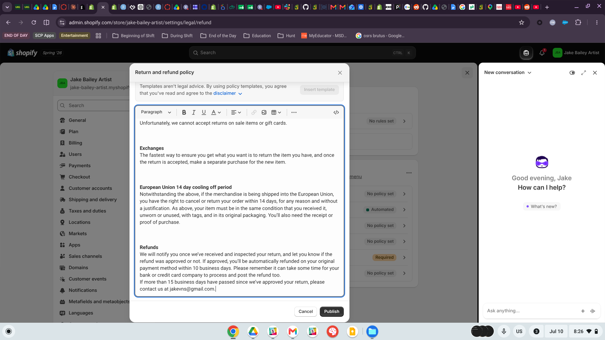
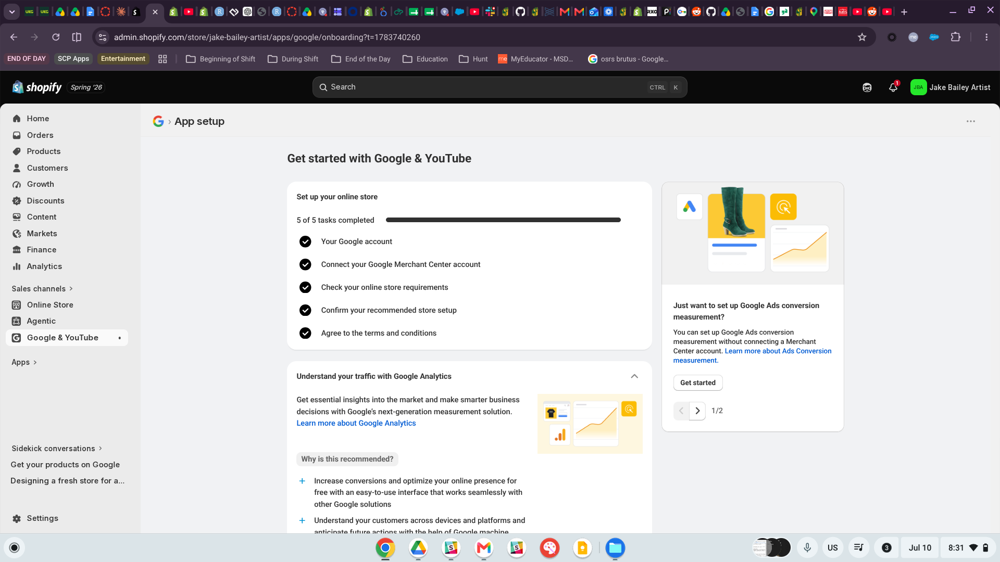
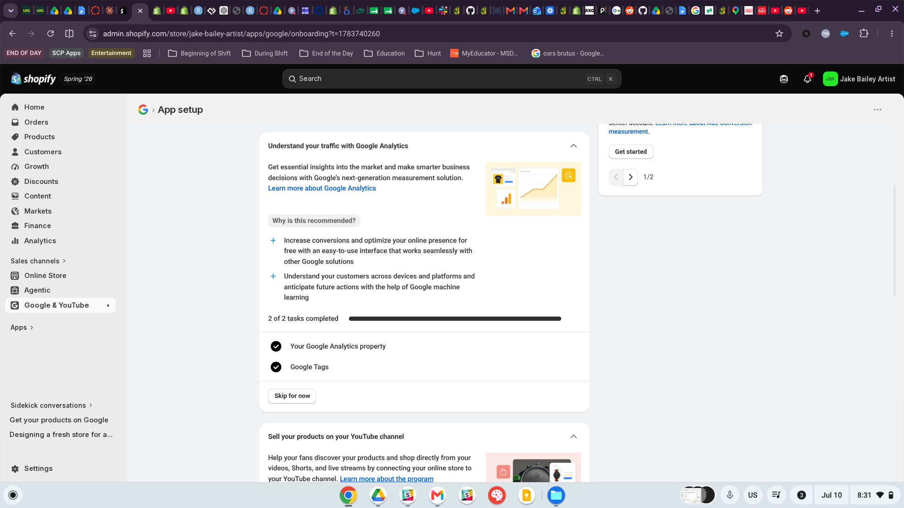
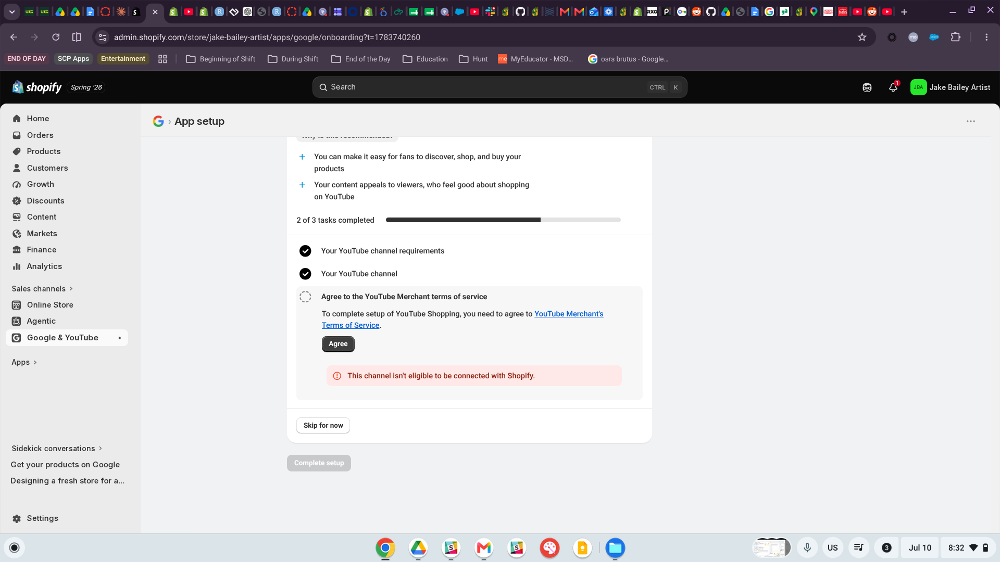
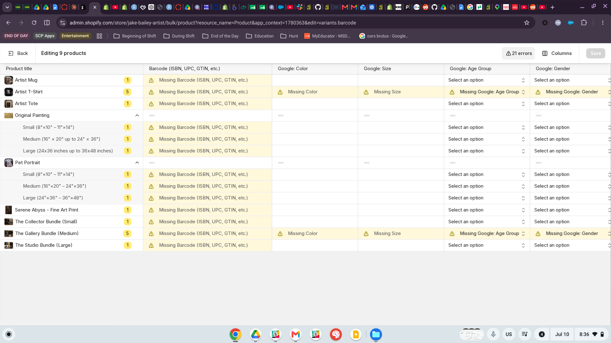
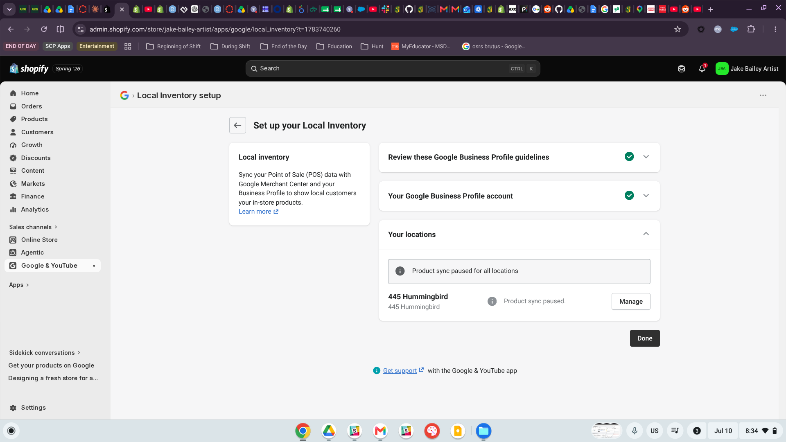
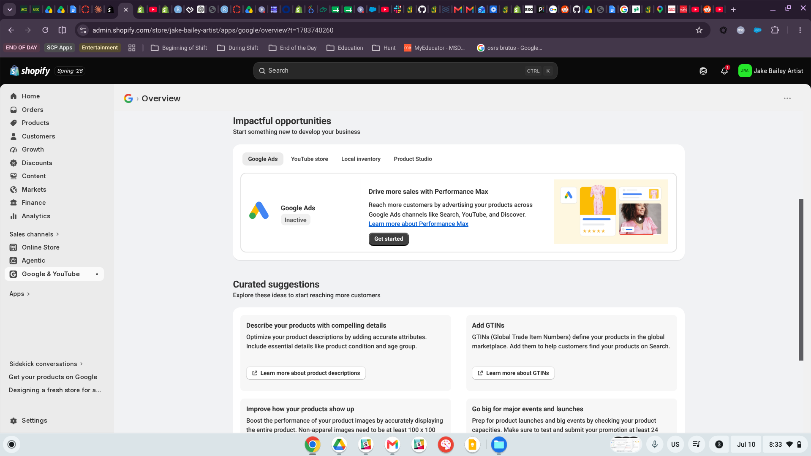

# Introduction

This report documents my attempt to connect my Shopify practice store, **Jake Bailey Artist**[^1], to Google Merchant Center through Shopify’s Google & YouTube sales channel. The store is a direct-to-consumer art brand that I built across the Week 3–5 Shopify assignments. It includes nine products organized into five collections: original paintings, fine art prints, commissioned pet portraits, artist merchandise, and gift bundles. The store also has a working navigation menu, an About page, a Contact page, and published shipping and return policies.

[^1]: Storefront: <https://jake-bailey-artist.myshopify.com/>

::: callout-note
## Outcome Summary

The main Shopify-to-Merchant-Center connection **did work**. My Google account, Merchant Center account, store requirements check, and terms agreement were all completed successfully. However, the setup also revealed **four major barriers** that would prevent the store from launching Google Shopping Ads right away: 21 product data errors across all 9 products, a paused local inventory sync because of business address limitations, an ineligible YouTube channel, and an inactive Google Ads account.

These issues show that connecting the store is only the first step. A real launch would still require cleaning up the product data, fixing account limitations, and making sure the advertising tools are actually ready to use. The rest of this report focuses on those barriers and what they mean for CPP Farm Store.

# Store Preparation

Before attempting the connection, I confirmed that the store met the basic readiness requirements from the assignment. The store had a clear name, nine product pages with titles, descriptions, images, prices, and availability, a main navigation menu linking to all five collections, an About page explaining the artist and the store, and a Contact page.

I also published shipping and return policies using Shopify’s policy templates and customized them for the store (@fig-policy). Since Google looks at these kinds of trust signals when evaluating store credibility, I made sure this step was completed before starting the setup.

{#fig-policy}

# Connection Attempt Evidence

I connected the store through the **Google & YouTube sales channel** in the Shopify admin. The main setup was completed successfully. As shown in @fig-setup, all five setup tasks were finished: my Google account, the Google Merchant Center account connection, the online store requirements check, the recommended store setup confirmation, and the terms and conditions agreement.

{#fig-setup}

Beyond the core connection, the channel also completed the Google Analytics integration, connecting a Google Analytics property and Google Tags to the store (@fig-analytics).

{#fig-analytics}

Not every part of the channel setup could be completed. The YouTube Shopping section failed with the error, “This channel isn’t eligible to be connected with Shopify” (@fig-youtube). YouTube Shopping has its own eligibility requirements that are separate from Google Merchant Center, including YouTube’s monetization and shopping program requirements. Since this was a personal channel, it did not meet those requirements.

I documented the error and skipped this step because the setup flow allowed me to continue without connecting YouTube Shopping.

{#fig-youtube}

# Product Sync and Product Listing Evidence

I was able to get to the product listing stage, and that is where the most important issues showed up. The channel’s bulk product editor flagged **21 errors across all 9 products** (@fig-errors).

Every product and variant was flagged for a **missing barcode (ISBN, UPC, or GTIN)**. This included the Artist Mug, Artist T-Shirt, Artist Tote, all Original Painting and Pet Portrait size variants, the Serene Abyss fine art print, and all three bundles.

Google also classified some products as apparel, which created extra requirements. The Artist T-Shirt and The Gallery Bundle were each flagged for four additional missing attributes: **Google Color, Size, Age Group, and Gender**.

{#fig-errors}

This means the products **made it partway into the listing pipeline, but they were not ready to sync**. The connection and feed existed, but none of the products could actually be published in their current state.

The pattern of errors makes sense for this catalog. Original paintings, commissioned pet portraits, and handmade bundles are one-of-a-kind products, so they do not naturally have UPCs or GTINs assigned to them. In that case, the GTIN issue is more structural to selling original artwork, not just a simple data entry mistake. The apparel warnings are different. Those are real missing product details that would need to be filled in before the products could run through Google correctly.

Product sync was also limited at the account level. In the Local Inventory setup (@fig-local), my Google Business Profile connected successfully, but **product sync was paused for all locations** because the only location available was my home address. Since that is not a verifiable retail business location, I paused the sync rather than presenting a residence as a storefront. This also follows the assignment’s instruction not to represent the practice store as an active operating business.

{#fig-local}

# Setup Barriers and Warnings

The attempt surfaced five distinct categories of barriers, summarized in @tbl-barriers.

| \# | Barrier | Evidence | Severity for a Real Launch |
|:-------------:|---------------|---------------|---------------------------|
| 1 | Missing GTINs/barcodes on all 9 products | @fig-errors | High — blocks product approval until identifiers are provided or products are declared custom goods |
| 2 | Missing apparel attributes (Color, Size, Age Group, Gender) | @fig-errors | High — Google requires these for apparel category listings |
| 3 | Business location not verifiable (home address); local sync paused | @fig-local | Medium — blocks local inventory features; core online listings can still work |
| 4 | YouTube channel ineligible for YouTube Shopping | @fig-youtube | Low — optional feature, but blocks a whole discovery channel |
| 5 | Google Ads account inactive | @fig-overview | High for advertising — the store is connected but cannot run Shopping Ads until an Ads account is activated with billing |

: Barriers encountered during the connection attempt

The channel’s Overview page (@fig-overview) supported the same product data issues I found in the bulk editor. It recommended adding GTINs, improving product descriptions with missing attributes like condition and age group, and improving product images. For example, non-apparel images need to be at least 100×100 pixels and show the full product.

The Overview page also showed Google Ads as **Inactive**, which is an important reminder that connecting Merchant Center is not the same thing as being fully ready to advertise. The store can be connected, but the product data and ad account still need to be ready before a real campaign could launch.

{#fig-overview}

# Fixes Needed Before a Real Launch

For this store — or any real business in a similar position — the following fixes would be required before Google Merchant Center and Google Shopping Ads could be used successfully:

1. **Resolve the GTIN requirement for handmade goods.** One-of-a-kind artwork will not have UPCs, so the right solution is not to make up barcodes. Instead, these products should be marked correctly as custom goods by setting `identifier_exists` to false in the product feed. That tells Google that a GTIN should not be expected. For mass-produced items like the mug, t-shirt, and tote, real GTINs could be used if they are provided by the supplier.

2. **Complete apparel attributes.** The Artist T-Shirt and Gallery Bundle need the missing Google fields filled in, including Color, Size, Age Group, and Gender. This is a more straightforward data-entry fix in the bulk editor.

3. **Establish a verifiable business identity.** A real launch would need a business address that is not a residence, a verified Google Business Profile, and ideally a custom domain instead of a `myshopify.com` subdomain. These details help Google evaluate whether the store looks credible and ready for customers.

4. **Activate and fund a Google Ads account.** Connecting Merchant Center only makes the products eligible to be listed. Actually running Shopping Ads would require an active Google Ads account with billing, conversion tracking, and campaign setup.

5. **Meet YouTube Shopping eligibility, if needed.** If YouTube Shopping became an important channel for the brand, the YouTube channel would need to meet Google’s shopping program requirements before that feature could be connected.

6. **Strengthen product content.** The store should also improve its product content by using higher-resolution full-product images, adding stronger descriptions with structured attributes, and assigning Google product categories to every item. This would help with both product approval and ad performance.

# CPP Farm Store Reflection

Based on this experience, CPP Farm Store should treat Google Merchant Center readiness as a **data and credibility project**, not just a technical connection project. The connection itself only took a few minutes. The real problems came from the store information, product data, and account readiness behind the connection.

The first priority should be product data. Like my art catalog, a lot of the Farm Store’s assortment probably includes products without standard manufacturer barcodes, such as student-produced meats, seasonal produce, and plants. Those products could run into the same GTIN issues I saw in my setup. The Farm Store should decide ahead of time which products are custom, store-produced, or local goods that should be declared to Google as having no identifier, and which products, like packaged foods with existing UPCs, should use real GTINs.

The Farm Store should also assign Google product categories and complete any category-specific attributes before connecting. My 21 product errors show that Google flags these gaps right away and can prevent listings from publishing until they are fixed. Product photography is also important. Google has image requirements, and food products especially need clear, high-quality photos because customers often decide based on how fresh or appealing the item looks.

The second priority is business credibility, and this is where CPP Farm Store has an advantage that my practice store did not. My local inventory sync failed because my home address is not a verifiable retail business location. The Farm Store, however, is a real retail location at Kellogg Ranch with regular hours. Before connecting, it should claim and verify its Google Business Profile, make sure its address, hours, and phone number are consistent everywhere, and use a custom domain for the store. This would help unlock local inventory features, allowing nearby customers to see what is available in-store. That could be a real advantage for a campus store serving the local community.

Finally, the Farm Store should treat advertising as a separate phase. A connected Merchant Center account does not automatically create traffic, especially if the Google Ads account is inactive like mine was. A better launch sequence would be: clean the product data first, verify the business identity second, enable free listings third, and only then move into paid Shopping Ads with a clear budget and conversion tracking in place.

# Appendix {.unnumbered}

::: callout-important
## Project Links

- **Live Storefront:** <https://jake-bailey-artist.myshopify.com/>
- **GitHub Page:** <https://github.com/jakevns/RStudio/tree/main/W06-GMC>
- **GitHub Repo:** <https://jakevns.github.io/RStudio/W06-GMC/Evans%2CJake-OACP-W06-GMC.html>
:::
