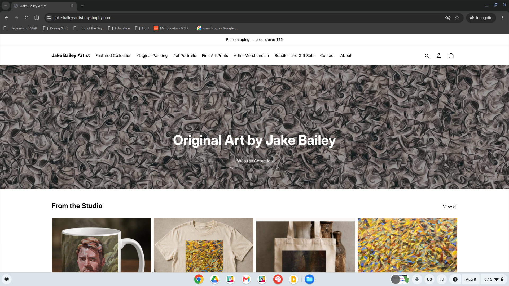
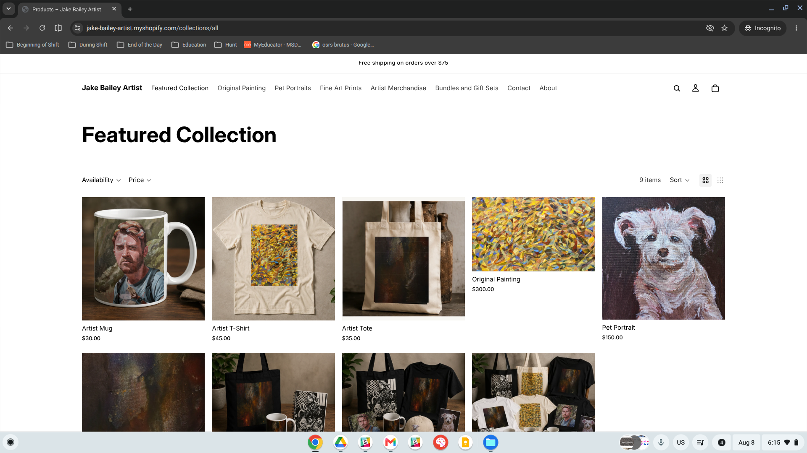
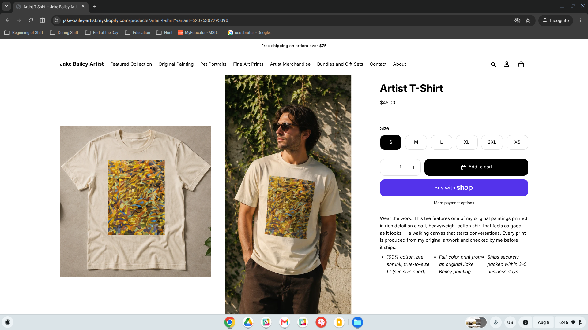
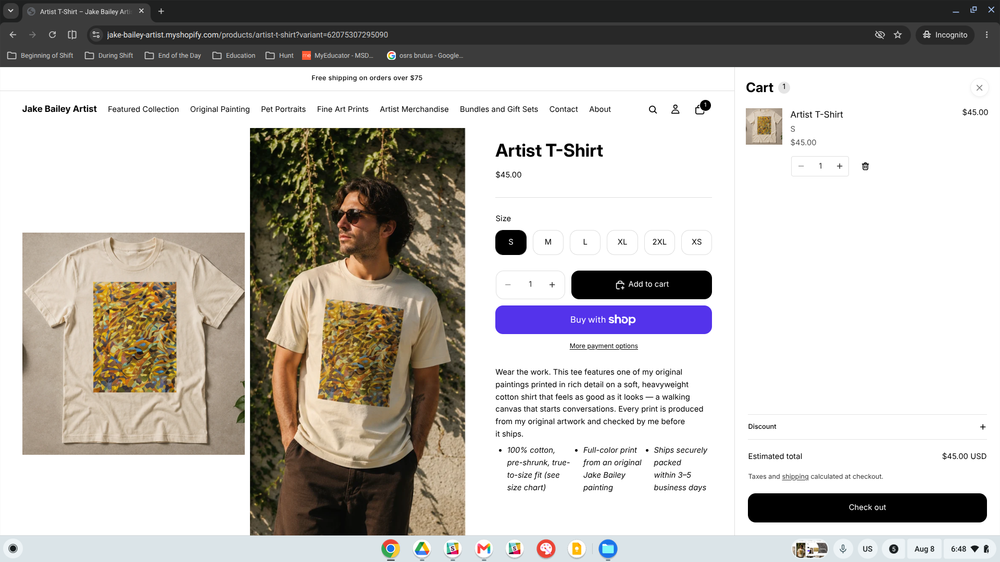
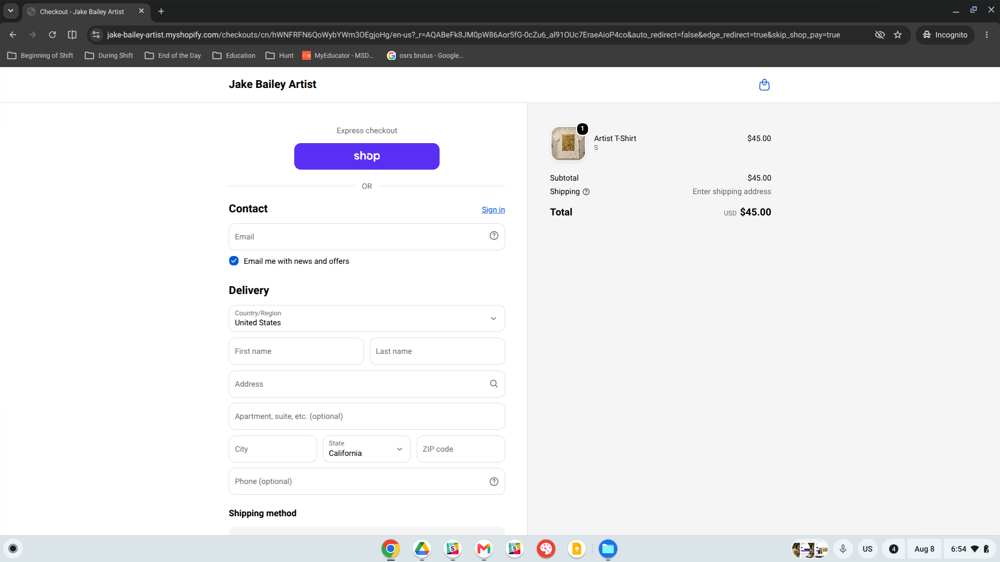
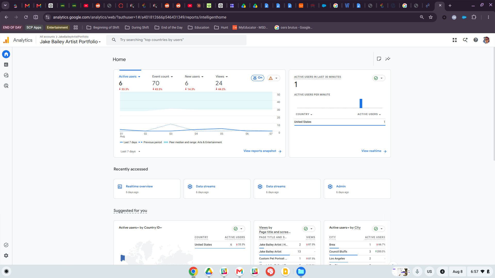

## Purpose

This assignment looks at the Jake Bailey Artist Shopify store from a customer’s point of view and reviews the GA4 data that is currently available. Testing the full shopping experience helps me catch anything that could be confusing or frustrating before real customers run into it, while the analytics show me how people are actually using the site. This gives me a chance to fix anything that needs attention before the Week 11 final Shopify project submission.

## Customer Journey Test

I tested the full customer experience in an incognito browser, starting on the **homepage** and moving through a **collection page, product page, cart, and checkout preview**. I stopped before entering any payment information, so no real purchase was made.

### Stage 1: Homepage

The homepage has a full-width hero image with the **“Original Art by Jake Bailey”** headline and a clear **“Shop the Collection”** button. Right below that is the **“From the Studio”** product carousel, and the announcement bar at the top makes the free shipping offer easy to notice right away.

### Stage 2: Collection Page

Clicking into **“Featured Collection”** shows all 9 products in a clean grid. Customers can filter by availability or price, sort the products, and change the grid layout. Each product also shows the image, name, and price right away, so you can browse without having to open every item.

### Stage 3: Product Page

Selecting the **Artist T-Shirt** opens a full product page with several lifestyle photos, size options from S–2XL, a quantity selector, and both **“Add to cart”** and **“Buy with Shop”** buttons. The description also includes clear product details like the material, where the design is printed, and the expected shipping timeline.

### Stage 4: Cart

Adding the T-Shirt opens a **slide-out cart** that shows the item, selected size, quantity controls, discount code box, and estimated total. The checkout button is easy to find, and the cart icon at the top updates with the number of items in the cart.

### Stage 5: Checkout Preview

Proceeding to checkout opens Shopify’s standard checkout page with **Shop Pay**, a sign-in option, and the full delivery form for contact information, address, and shipping. The order summary stays visible on the right with the subtotal, shipping information, and total. I stopped testing at this point before entering any payment details.

## Store Strengths

1.  **Clean, simple design.** The dark hero banner and white space keep the focus on the artwork instead of making the site feel crowded, which works well for an art store.

2.  **Strong product pages.** The Artist T-Shirt page uses both a regular product image and a lifestyle photo, along with specific details like 100% cotton, printed from an original painting, and checked before shipping. That makes the product feel more personal and trustworthy.

3.  **Easy cart and checkout process.** The slide-out cart lets shoppers review everything without leaving the page, and Shopify’s checkout gives returning customers the option to use Shop Pay while still keeping the regular checkout form available.

## Areas for Improvement

1.  **Not enough trust signals.** I did not see reviews, return information, or security badges while browsing the collection, product, or cart pages. The checkout page has the standard policy links, but showing shipping and return information earlier would make the store feel more trustworthy before customers get that far.

2.  **The homepage may not be pushing people deeper into the store.** GA4 shows a small number of active users over the last 7 days, and the homepage is getting more views than the product or collection pages. Adding more specific buttons under the hero, like **“Shop Pet Portraits”** or **“Shop Prints,”** could give visitors more reasons to keep browsing.

3.  **The main collection feels too broad.** All 9 products are currently grouped together in one **“Featured Collection,”** even though the store already has separate categories for Original Paintings, Pet Portraits, Fine Art Prints, and Artist Merchandise. Using those categories more clearly on the collection page would make it easier for customers to find what they are actually looking for.

## Analytics Review

GA4 data for the Jake Bailey Artist Portfolio property over the last 7 days shows fairly light traffic. The site had **6 active users**, which is down 33.3% from the previous period, along with **6 new users**, **70 total events**, and **24 page views**. All 6 users were located in the United States. Most of the views went to the homepage and general storefront, while the Custom Pet Portrait page received only one view. This suggests that people are reaching the site, but not many are clicking deeper into individual products yet.

Traffic is still really low overall, which makes sense since this is a practice store and I am not running any real paid marketing to it yet. Still, every main GA4 metric went down compared with the previous week, including active users, new users, events, and views. Even with such a small sample, I think that trend is worth paying attention to instead of just ignoring it as random noise.

## Improvement Plan

Before the final submission, I want to clean up how the store is organized by splitting the single **“Featured Collection”** into the collections that already show up in the navigation: Original Painting, Pet Portraits, Fine Art Prints, Artist Merchandise, and Bundles and Gift Sets. I also want to add more trust signals directly to the product pages, especially a short shipping/returns section and any reviews I can include, since customers should not have to wait until checkout to see that information. Finally, I plan to add another CTA under the homepage hero that links straight to a specific collection, probably Pet Portraits first, and then use GA4 to see if that helps get more people past the homepage and into the actual store.

## Appendix

- **GitHub Pages:** [jakevns.github.io/RStudio/](https://jakevns.github.io/RStudio/)
- **GitHub Repository:** [github.com/jakevns/RStudio/tree/main/M10](https://github.com/jakevns/RStudio/tree/main/M10)
- **Shopify Store (test):** [jake-bailey-artist.myshopify.com](https://jake-bailey-artist.myshopify.com)
