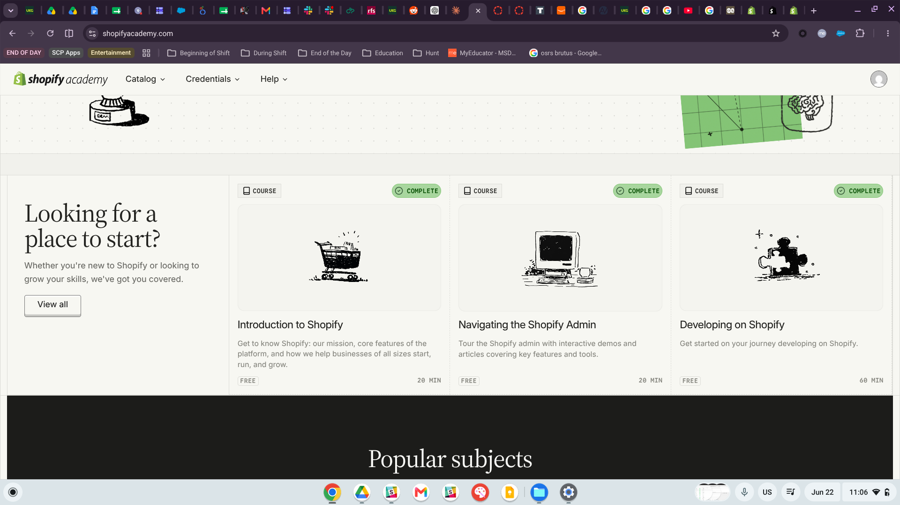
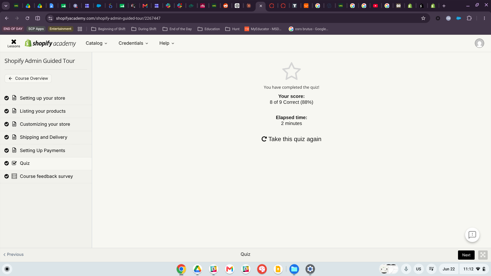
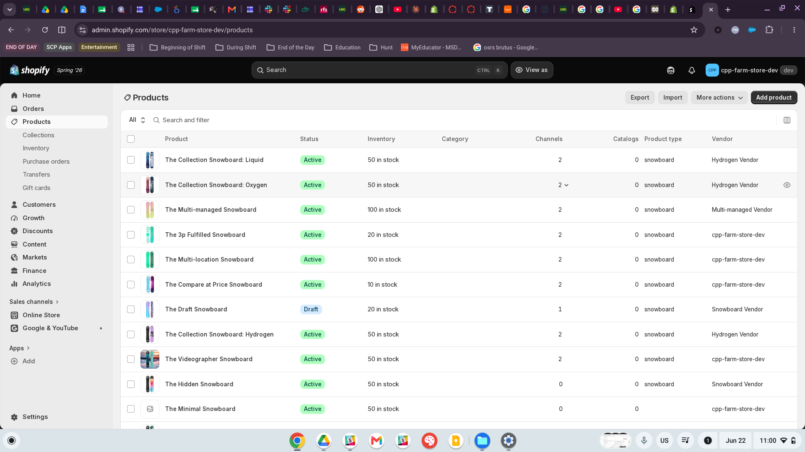
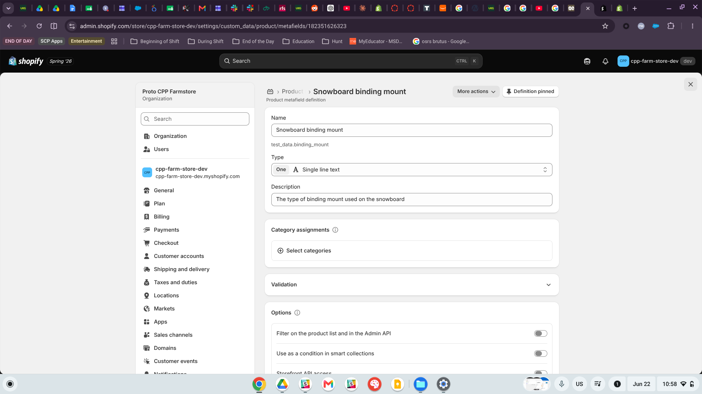
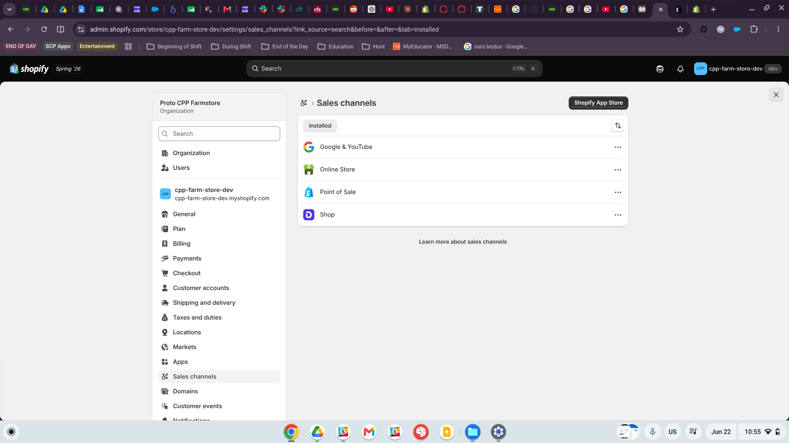

# Overview {#sec-overview}

This report summarizes the completion of *Shopify Academy Learning* and the exploration of the *Shopify Admin* for **ITP Assignment 1**. The main purpose of this assignment was to create a strong foundation with Shopify, which is the leading e-comerce platform and will prepare myself for the *individual Shopify Retail Store assignment*, the *GA4 Integration Project*, and the *CPP Farm Store Consulting Project*.

::: callout-note
## Assignment Scope

This assignment is **to learn and practice only**, it does not involve any real product, payments, or live buisness data. The store data used is for exploration and is the default store when setting up a Shopify business (snowboarding products), and will be used for future cpp-farm-store-dev development.
:::

# Evidence of Shopify Learning Completion {#sec-evidence}

## Courses Completed

The following Shopify Academy modules were completed as part of this assignment:

::::: panel-tabset
{#fig-quiz fig-align="center"}

### Introduction to Shopify

**Duration:** \~20 minutes

Covered Shopify's history, mission, and platform capabilities. Key topics included:

- Shopify's origins (built to sell snowboards)
- Unified commerce vs. omni-channel commerce
- B2C, B2B, and Retail use cases
- Shopify plans: Basic, Grow, Advanced, Plus, and Enterprise

> The introduction to Shopify section covered the Platform's background, mission statement, and the main capabilities. Shopify was originally started to help the founder sell snow boards online but the available e-commerce platforms did not satisfy their needs. Since then, Shopify has grown to be the standard platform used by millions of merchants; that range from small Mom and Pop stores to larger, multi-million dollar enterprises. Shopify's mission is to make commerce more accessible for everyone, and the platform has been globally recognized by organizations such as Gartner, BCG, and IDC for their entrepreneurial features, checkout abilities, and their constant support for midmarket growth.
>
> One of the main ideas that were introduced was a unified commerce approach, which is Shopify's strategy to combine various sales channels: online, in-store, wholesale, and B2B, all into a single centralized system. This goes beyond traditional omnichannel selling, which was mainly focusing on a consistent customer experience across all channels. With unified commerce, Shopify has created one shared source for products, customers, orders, and inventory. The course also reviewed Shopify's plan options: basic, Grow, Advanced, Plus, and Enterprise. Each plan offered a different level of access, reporting, and international commerce tools which can make Shopify useful for business at all of their various stages; from making their first online sale to expanding to other countries.

### Navigating the Shopify Admin

**Duration:** \~20 minutes

Explored key Admin sections including:

- **Products** — adding, managing, variants, meta-fields, gift cards, and collections
- **Inventory** — states (unavailable, committed, available, on hand), bulk editing, CSV imports, and B2B catalogs
- **Orders & Draft Orders** — creating manual orders, applying discounts, sending invoices
- **Role-Based Access Controls (RBAC)** — assigning permissions by role for efficient staff management

> In the Navigating the Shopify Admin section, Shopify covered several modules that were focused on everyday tools merchants will use to manage their stores. The Product section explained how to add products from scratch, including writing titles, descriptions, uploading media, setting prices, compare at prices, tracking inventory across locations, and managing shipping details. It also covered variants, which allow merchants to offer multiple product options without needing to create separate listings. In addition, the module introduced meta-fields and meta-objects for storing customer product information, gift cards for offering flexible store credit, and collections for products organization (browsable categories).
>
> Shopify went beyond the product catalog by also covering inventory management. This included the four inventory states: unavailable, committed, available, and on hand. It also introduced bulk editting tools, CSV imports, and transfers between locations for businesses that operate across multiple states. Draft orders were presented as an option to manually create customer orders, which are useful when taking phone orders, bulk purchasing, customer prices, or customer service situations. Finally, Naviating the Shopify Admin covered role based access controls (RBAC), as an efficient way to manage staffing permissions. Instead of assignment permissions to individual employees, merchants can create roles with specified permissions set and then assigning those roles to multiple staff members. When the role is updated, everyone assigned to the role will get the updates automatically.

### Developing on Shopify

**Duration:** \~60 minutes

Introduced Shopify from a developer's perspective:

- Shopify as a cloud-based SaaS platform
- Development stores: *Client Transfer* vs. *Test and Build* types
- Shopify Partner Program benefits
- Admin tour covering Products, Orders, Customers, Collections, Analytics, and Sales Channels
- Simulating transactions with Shopify's Bogus Gateway

> With the Developing on Shopify module, we were introduced to Shopify from a developer's perspective; presenting the platform as more than just a storefront builder. Instead, Shopify can function as a commerce operating system that supports many varrious parts of the online business. One major takeaway was that Shopify's site architecture sits between a traditional monolithic system (simple but more closed off), and a full microservice setup (flexible but more complex to maintain). Shopify combines the best attributes of both by providing a reliable core infrastructure and their APIs/ extension points that developers use to customize the platform. This allows developers to build on top of Shopify without having to create or maintain a core commerce feature themselves, which reduces development work/ amount spent on development. Shopify also emphasized to start with their built in features before creating custom solutions, since native tools are typically easier to maintain while the platform evolves.
>
> The module also reviews Shopify's partner Program and the two main types of development stores avalable to partners: Client Transfer Stores, which are creatred through the partner dashboard (Designed to be handed off to a client once finished), and Test and Built Stores which are creatred through the Dev Dashboard (used for testing new features, apps, developer previews, but they can't be transfered to the client). The lab portion involved creating a development store for a fictional apparel brand called Stylish Stitches, importing sample product data through a CSV file, exploring the Horizon theme, and simulating transactions using Shopify's Bogus Gateway. Overall, Shopify provided a practical look at how a Shopifty store is built and tested from the developer side before going live.

### Shopify Admin Guided Tour

**Duration:** \~20 minutes + Quiz

Completed all lessons and the final quiz:

- Setting up your store
- Listing products (variants, metafields, inventory tracking)
- Customizing your store with themes (Horizon, AI powered theme generator)
- Shipping and delivery rate configuration
- Setting up Shopify Payments

> The Shopify Admin Guided Tour provided a walk through of the key setup steps that are involved in launching a store, which are organized in five lessons. The first lesson introduced Sidekick, which is Shopify's built in AI assistant, and is able to help answer admin related questions, generate product descriptions, configure settings, and assist with tasks (such as domain setup without leaving the Shopify Admin). The product listing lesson reinforced important concepts regarding titles, descriptions, media, pricing, inventory tracking, and variants. It also highlight the duplicated product feature as a time saver option when creating similiar items. The theme customization lesson introduced Horizon as Shopify's default free theme and demonstrates Shopify's AI powered theme generator; which can create multiple storefront design options based on descriptions of a brands specified vision.
>
> The Final two lessons focused ont eh oprtation sides of running a Shopify store. The shipping and delivery lesson coverd how to set up specific shipping zones, choose between flat rates or carrier calculated rates, and customize shipping rules (such as free shipping thresholds that encourage larger orders). The payments lesson explained the Shopify payment set up process; including selecting a business entity type, providing industry information for compliance/reporting, verifying identity, and connecting a bank account for payouts. IT also noted that third party payment providers are available for merchants who prefer other options/alternatives. The end of the module was a 9 question quiz in which I completed in 2 minutes and scored 8 out of the 9 questions correctly (88%).

**Quiz result: 8 of 9 correct (88%) in 2 minutes.**[^1] ::::

## Quiz Completion Screenshot

The screenshot below shows my completed Shopify Admin Guided Tour quiz result.

{fig-align="center" width="85%"}

As shown in @fig-quiz, all five course lessons were completed (checkmarks visible in the left sidebar), and the quiz was finished in 2 minutes with an 88% score.

# Shopify Admin Exploration Screenshots {#sec-screenshots}

The following screenshots document my hands-on exploration of the `cpp-farm-store-dev` Shopify Admin environment.

## Products Catalog

{#fig-products fig-align="center" width="90%"}

@fig-products shows the Products section of the Admin, displaying the default snowboarding equipment catalog pre-loaded in the development store. Visible columns include Product name, Status (Active/Draft), Inventory count, Channels, Catalogs, Product type, and Vendor — demonstrating how product data is organized at a glance.

## Metafield Definition

{#fig-metafield fig-align="center" width="90%"}

@fig-metafield shows a custom product metafield definition I explored: *"Snowboard binding mount"* — a single-line text field used to store specialized product data (`test_data.binding_mount`). This demonstrates how metafields extend standard product information beyond default Shopify fields.

## Sales Channels Settings

{#fig-channels fig-align="center" width="90%"}

@fig-channels shows the Sales Channels settings panel for the Proto CPP Farmstore organization, with four channels installed: **Google & YouTube**, **Online Store**, **Point of Sale**, and **Shop**; illustrating Shopify's unified commerce capabilities across multiple selling surfaces.

::: callout-tip
## Admin Exploration Note

The development store came pre-loaded with snowboarding equipment products and vendor data, which made it easy to explore product management, metafield definitions, and inventory settings in a realistic context.
:::

:::

# Feature Reflection {#sec-features}

The following five Shopify features are particularly important for online retailing.

| Feature | Primary Value | Admin Location |
|------------------------|------------------------|------------------------|
| Products & Variants | Core catalog management | Products |
| Collections | Product discovery & organization | Products → Collections |
| Inventory Management | Stock control & oversell prevention | Products → Inventory |
| Sales Channels | Multichannel selling | Settings → Sales Channels |
| Shopify Payments & Checkout | Conversion & revenue capture | Settings → Payments |

**Products and Variants** are the foundation of any Shopify store, as a product listing keeps all of the important item details in a single place, while variants allow one products to include different options, such as size or color. This helps keep the catalog organized without duplicate listings.

**Collections** make it easier for customers to browse products by category, theme, or purpose. They can be created manually or set up through automated conditions that add matching products on their own. This provides an easier shopping experience that is more intuitive while also reducing the amount of work needed to maintain the catalog.

**Inventory Management** assist in merchants tracking stock across four states: unavailable, committed, available, and on hand. Inventory updates automatically as sales are made and businesses with multiple locations can transfer stock between sites directly through the Shopify admin.

**Sales Channels** allow one back end product catalog to support multiple storefronts at the same time; including Online Store, Point of Sale, the Shop App, and Google and Youtube. Since these channels share the same inventory and pricing information, merchants can keep everything consistent without extra manual updates.

**Shopify Payments and Checkout** are built directly into the Shopify Admin, making it easy for merchants to manage payments, compliance, identity verification, and payouts in one place. Shopify also supports third party payment providers, which provides more flexibility for merchants.

# CPP Farm Store Application Reflection {#sec-cpp}

::: callout-important
## CPP Farm Store Context

CPP Farm Store is a local agricultural retail business operating as part of California State Polytechnic University, Pomona. This reflection considers how Shopify could support its digital retail expansion.
:::

Shopify could be a great fit for the CPP Farm Store because it would provide a simple, and scalable way to connect the in person clientele with online sales without requiring a big development team. The Online Store channel would help CPP Farm Store reach customers beyond campus by offering fresh products, nursery plants, gift baskets, and agricultural supplies online. Simultaneously, the Shopify Point of Sale could support their transactions at the physical store location, with both channels pulling from the same inventory system to maintain accurate stock levels.

Shopify's tools could make the store easier to manage and promote with collections being used to organize products into clear categories (such a "season produce"), making it easier for customers to browse. Automated discounts could support students or faculty pricing without hindering the staff to manually have to adjust each order. As the store grows, Shopfy Analytics could provide the CPP Farmstore with useful insights into which products are sellings (instead of relying on visually seeing, which is what they are currently doing), when they are selling ti, and what customers are buying online vs in store. This data would help the store team make smarter decisions about purchasing from their vendors, promotions, and future marketing endevours. Since the CPP Farm Store also has an educational mission, the Google and Youtube sales channels would also help increase visibility for campus events, seasonal harvests, and special promotions with minimal costs.

# Appendix {#sec-appendix}

## Course Links

- [Shopify Academy](https://www.shopifyacademy.com/)
- [Introduction to Shopify](https://www.shopifyacademy.com/)
- [Developing on Shopify](https://www.shopifyacademy.com/developing-on-shopify)
- [Shopify Admin Guided Tour](https://www.shopifyacademy.com/shopify-admin-guided-tour)

## Project Links

- **GitHub Repository:** <https://github.com/jakevns/RStudio>
- **GitHub Pages (Published Report):** <https://jakevns.github.io/RStudio/assign1/Bailey,%20Jake-ITP-Assign1.html>

## Session Info

```{r}
#| label: session-info
#| code-fold: true
#| code-summary: "Show session info"
sessionInfo()
```
:::::

[^1]: One question regarding domain setup options was missed; the lesson covered connecting third-party domains and buying through Shopify as the two primary options.
